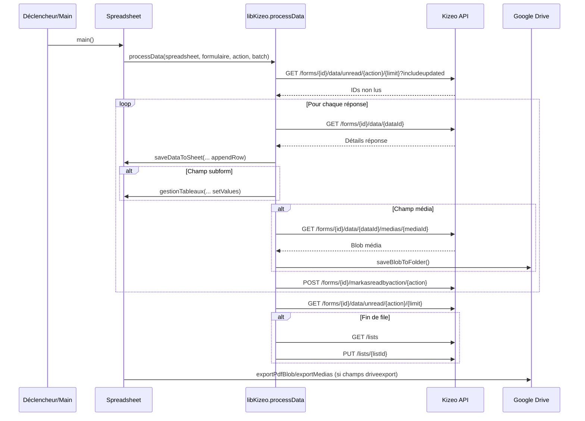
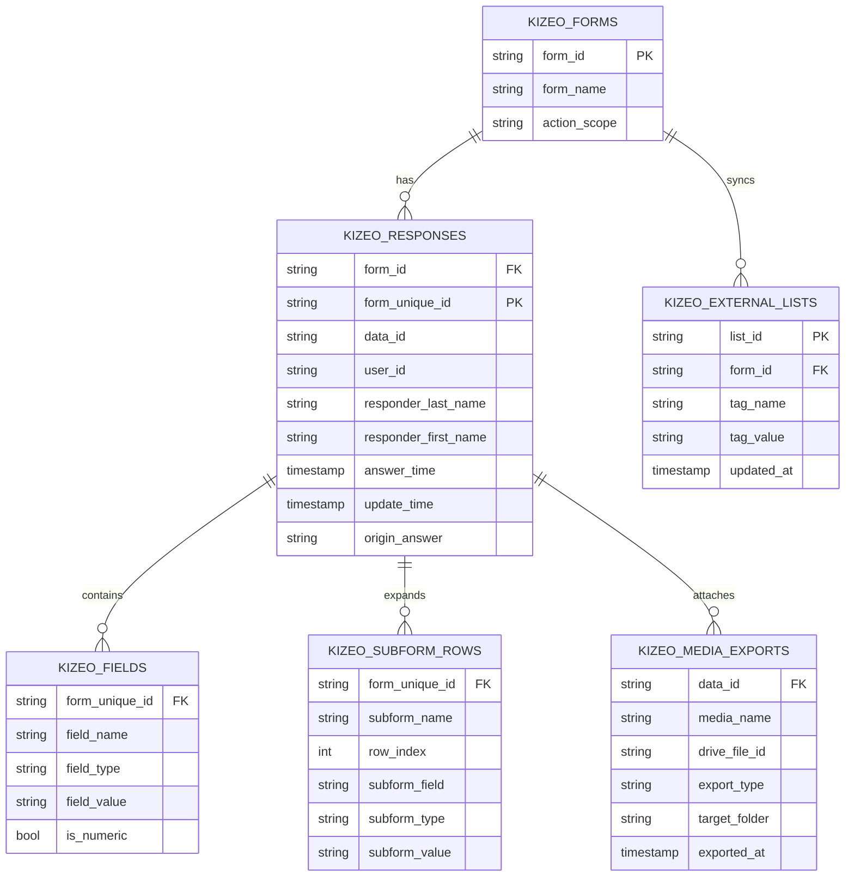
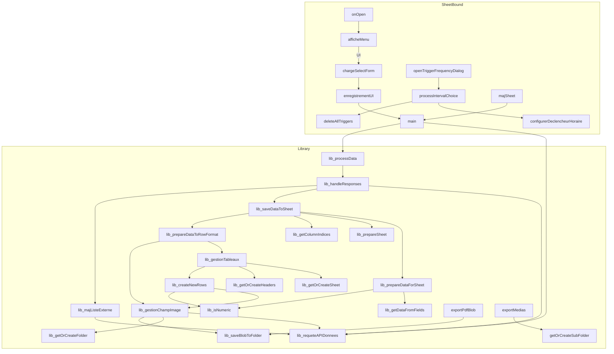

# Kizeo to Sheets Apps Script → BigQuery – Global Context & BigQuery Migration Prep

## Title & Abstract
- **Titre :** Kizeo to Sheets Apps Script → BigQuery – Global Context & BigQuery Migration Prep
- **Résumé exécutif :** La solution repose sur une bibliothèque Apps Script (`libKizeo`) et un script lié à Google Sheets qui orchestrent l’ingestion des formulaires Kizeo et leur stockage. Les fonctions clés `processData` et `handleResponses` récupèrent les réponses non lues, les écrivent dans des onglets `Nom || ID`, marquent les entrées comme lues et synchronisent les listes externes. L’interface côté Sheet (menus, modales HTML) permet à l’utilisateur de sélectionner un formulaire, de configurer un déclencheur horaire et de lancer des exports Drive (PDF, médias) via `main`. Les médias sont téléchargés avec `gestionChampImage`, stockés dans Drive et référencés dans le Sheet par des formules `HYPERLINK`, tandis que les sous-formulaires sont ventilés dans des onglets dédiés. La robustesse dépend de `handleException` (logs + email) et de la ScriptProperty `etatExecution`, mais aucun retry ni gestion fine des quotas n’est en place et le token Kizeo est lu depuis un autre Sheet. Ce document synthétise l’architecture, l’inventaire fonctionnel exhaustif, la cartographie API, le modèle de données et fournit un plan détaillé pour migrer la solution vers BigQuery. Les inconnues (identifiants cibles, gouvernance du secret, formulaires en production) sont listées en fin de document pour validation.
- **Table des matières :**
  - [Title & Abstract](#title--abstract)
  - [Architecture Overview](#architecture-overview)
  - [Repository Map](#repository-map)
  - [Components & Responsibilities](#components--responsibilities)
  - [Function Inventory](#function-inventory)
  - [Kizeo API Usage Map](#kizeo-api-usage-map)
  - [Google Sheets Data Model](#google-sheets-data-model)
  - [UI & Interaction (Sheet)](#ui--interaction-sheet)
  - [Configuration & Secrets](#configuration--secrets)
  - [Error Handling, Logging & Observability](#error-handling-logging--observability)
  - [Quality, Tests & Tooling](#quality-tests--tooling)
  - [Known Issues & Tech Debt](#known-issues--tech-debt)
  - [BigQuery Migration Readiness](#bigquery-migration-readiness)
  - [Gaps & Open Questions](#gaps--open-questions)
  - [Appendix – Code Browser](#appendix--code-browser)

## Architecture Overview
```mermaid
flowchart LR
    subgraph KizeoAPI["Kizeo REST v3"]
        A1[GET /forms/.../data/unread]
        A2[GET /forms/.../data/{id}]
        A3[POST /forms/.../markasreadbyaction]
        A4[GET /forms/.../data/{id}/pdf]
        A5[GET /forms/.../data/{id}/medias/{mediaId}]
        A6[GET/PUT /lists]
    end

    subgraph AppsScriptLibrary["Apps Script Library libKizeo"]
        L1[processData]
        L2[handleResponses]
        L3[saveDataToSheet]
        L4[gestionTableaux]
        L5[gestionChampImage]
        L6[majListeExterne]
    end

    subgraph SheetBoundScript["Script lié au Sheet"]
        S1[onOpen<br/>configurerDeclencheurHoraire]
        S2[main<br/>(validation config)]
        S3[UI (HtmlService)]
        S4[exportPdfBlob & exportMedias]
    end

    subgraph GoogleSheet["Google Sheets stockage"]
        G1[Feuilles Formulaire<br/>« Nom || ID »]
        G2[Sous-formulaires<br/>« Nom || ID || SousForm »]
        G3[Listes externes]
    end

    subgraph GoogleDrive["Google Drive"]
        D1[Dossiers Images & exports]
    end

    subgraph Users["Utilisateurs"]
        U1[Opérateur Sheet]
        U2[Admin (alertes mail)]
    end

    U1 -->|Menu "Configuration Kizeo"| S3
    S3 -->|google.script.run| S2
    S1 -->|Déclencheur horaire| S2
    S2 --> L1
    L1 -->|UrlFetchApp| KizeoAPI
    KizeoAPI --> L1
    L3 -->|appendRow| G1
    L4 --> G2
    L5 -->|DriveApp| D1
    S2 --> S4 --> D1
    L6 --> KizeoAPI
```





## Repository Map
| Repo | Path | Contenu principal |
|---|---|---|
| Bibliothèque Apps Script | `lib/` | Ingestion Kizeo, mapping Sheets, médias Drive, listes externes, gestion erreurs. |
| Script lié au Sheet | `sheetInterface/` | Orchestrateur `main`, UI, déclencheurs, HTML, manifest dédié. |

### Arborescences
| Répertoire | Contenu |
|---|---|
| `lib/` | `0_Data.js`, `APIHandler.js`, `BigQuery.js`, `GestionErreurs.gs.js`, `Images.js`, `ListesExternes.js`, `Outils.js`, `Tableaux.js`, `VarGlobales.js`, `zz_Tests.js`, `appsscript.json`. |
| `sheetInterface/` | `Code.js`, `outils.js`, `UI.js`, `appsscript.json`, `afficheSelectForm.html`, `timeIntervalSelector.html`, `ZZ_tests.js`. |

### Manifests Apps Script
| Fichier | timeZone | runtimeVersion | Libraries | Services avancés | oauthScopes (déduits) |
|---|---|---|---|---|---|
| `lib/appsscript.json` | Europe/Paris | V8 | Aucun | Aucun | UrlFetch, Spreadsheet, Drive, Mail (implicites). |
| `sheetInterface/appsscript.json` | Europe/Paris | V8 | `libKizeo` (`121Um2Qbjr1_1yEjVM8Y7IH6ybZhX1v7frd4iM5HCsZAaD3op_GbADAY2`, dev mode) | Drive v2 (`Drive`) | Spreadsheet, Drive, ScriptApp, HtmlService, Mail, External request. |

## Components & Responsibilities
| Composant | Responsabilités | Fichiers | Points d’entrée | Triggers | Dépendances |
|---|---|---|---|---|---|
| Ingestion API | Récupérer les réponses non lues, marquer comme lues, retourner médias | `lib/0_Data.js`, `lib/APIHandler.js` | `processData`, `handleResponses` | Appelé par `main` | `UrlFetchApp`, `SpreadsheetApp` |
| Mapping Sheet | Normalisation données, entêtes dynamiques, sous-formulaires, conversions | `lib/0_Data.js`, `lib/Tableaux.js` | `saveDataToSheet`, `prepareDataToRowFormat` | — | `SpreadsheetApp`, `DriveApp` |
| Médias Drive | Télécharger blobs (photos/signatures), créer dossiers, exporter PDF | `lib/Images.js`, `sheetInterface/Code.js` | `gestionChampImage`, `exportPdfBlob`, `exportMedias` | — | `DriveApp`, `UrlFetchApp` |
| Listes externes | Mettre à jour tags Kizeo après traitement complet | `lib/ListesExternes.js` | `majListeExterne` | — | `requeteAPIDonnees` |
| Déduplication & maintenance | Purger les doublons côté BigQuery, surveiller les buffers streaming | `lib/BigQuery.js` | `bqPurgeDuplicateParentRows`, `bqPurgeDuplicateSubTableRows` | — | `BigQuery` |
| Gestion erreurs | Journaliser et notifier par mail | `lib/GestionErreurs.gs.js` | `handleException` | — | `MailApp`, `ScriptApp` |
| UI & scheduling | Menu Sheets, modales HTML, sélection formulaire, déclencheurs | `sheetInterface/UI.js`, `sheetInterface/outils.js` | `afficheMenu`, `chargeSelectForm`, `enregistrementUI`, `configurerDeclencheurHoraire` | `onOpen`, time-based | `HtmlService`, `PropertiesService` |
| Orchestrateur | Boucle sur formulaires, valide la config, lance ingestion, exports Drive, gère verrou `etatExecution` | `sheetInterface/Code.js` | `main` | Déclencheur horaire configurable | `libKizeo`, `DriveApp`, `PropertiesService` |

Lien bibliothèque → script : le script lié appelle les fonctions exposées par la librairie `libKizeo` (ex. `libKizeo.processData` dans `sheetInterface/Code.js:173`, `libKizeo.handleException` dans `sheetInterface/UI.js:11`).

## Function Inventory
**Sommaire rapide (A→Z)** : `afficheMenu`, `appendRowsToSheet`, `bqBackfillForm`, `chargeSelectForm`, `chargelisteFormulaires`, `configurerDeclencheurHoraire`, `createHyperlinkToSheet`, `createNewRows`, `deleteAllTriggers`, `emailLogger`, `enregistrementUI`, `exportMedias`, `exportPdfBlob`, `getColumnIndices`, `getDataFromFields`, `getEtatExecution`, `getNewHeaders`, `getOrCreateFolder`, `getOrCreateHeaders`, `getOrCreateSheet`, `getOrCreateSubFolder`, `gestionChampImage`, `gestionFeuilles`, `gestionTableaux`, `handleException`, `handleResponses`, `isNumeric`, `main`, `majListeExterne`, `majSheet`, `onOpen`, `openTriggerFrequencyDialog`, `prepareDataForSheet`, `prepareDataToRowFormat`, `prepareSheet`, `processData`, `processIntervalChoice`, `requeteAPIDonnees`, `saveBlobToFolder`, `saveDataToSheet`, `setScriptProperties`, `setScriptPropertiesTermine`.

| Function | File:Line | Purpose | Inputs | Outputs | Side effects | Calls | Called by | Errors/Retry |
|---|---|---|---|---|---|---|---|---|
| `afficheMenu()` | `sheetInterface/UI.js:6` | Ajoute le menu personnalisé « Configuration Kizeo » dans l’UI. | — | — | Crée un menu via `SpreadsheetApp.getUi()`. | `SpreadsheetApp.getUi`, `libKizeo.handleException` (si erreur) | `onOpen` | Gestion d’erreur via `handleException`. |
| `appendRowsToSheet(sheet, rows)` | `lib/Tableaux.js:120` | Insère un lot de lignes dans un onglet de sous-formulaire. | `Sheet`, `Array<Array>` | — | Écrit via `Range.setValues`. | — | `gestionTableaux` | Erreurs propagées (pas de retry). |
| `bqBackfillForm(formId, options)` | `lib/0_Data.js:491` | Exécute un backfill BigQuery direct (raw, parent, sous-formes, médias optionnels). | `string`, `Object?` (startDate, endDate, chunkSize, includeMedia, spreadsheetId) | `Object` (résumé d’ingestion) | Appels BigQuery (`insertAll`), lecture Kizeo `data/all`, Drive optionnel si médias. | `createIngestionServices`, `requeteAPIDonnees`, helpers BigQuery (`bqIngest*`) | Exécution manuelle (`clasp run`), scénarios `zzDescribeScenarioBackfill*` | `handleException`, pas de retry automatique, chunking configurable. |
| `openTriggerFrequencyDialog()` | `sheetInterface/UI.js:137` | Affiche la modale HTML de configuration des déclencheurs. | — | — | Interaction UI (`HtmlService`). | `HtmlService.createTemplateFromFile`, `getStoredTriggerFrequency` | Menu utilisateur | `uiHandleException` sur erreur. |
| `chargeSelectForm()` | `sheetInterface/UI.js:26` | Ouvre la modale de sélection de formulaire. | — | — | UI modale (HtmlService). | `HtmlService.createTemplateFromFile`, `SpreadsheetApp.getUi` | Menu « Configuration Kizeo » | `handleException`. |
| `chargelisteFormulaires()` | `sheetInterface/UI.js:43` | Récupère et trie la liste Kizeo des formulaires. | — | `Array` de formulaires | Appel API (`UrlFetch`). | `libKizeo.requeteAPIDonnees` | `afficheSelectForm.html` via `google.script.run` | `handleException`. |
| `configurerDeclencheurHoraire(valeur, type)` | `sheetInterface/outils.js:7` | Configure un déclencheur temporel pour `main`. | `number`, `'M'|'H'` | — | Supprime puis crée un trigger. | `deleteAllTriggers`, `ScriptApp.newTrigger` | `processIntervalChoice` | `handleException`. |
| `createHyperlinkToSheet(spreadsheet, sheet)` | `lib/Tableaux.js:129` | Génère une formule `HYPERLINK` vers un sous-onglet. | `Spreadsheet`, `Sheet` | `string` | Aucun. | — | `gestionTableaux` | Pas de gestion spécifique. |
| `createNewRows(tableau, idReponse, headers, formId, spreadsheet)` | `lib/Tableaux.js:93` | Formate les lignes d’un sous-formulaire (y compris médias). | `Array<Object>`, `string`, `Array<string>`, `string`, `Spreadsheet` | `Array<Array>` | Peut déclencher téléchargements médias. | `gestionChampImage`, `isNumeric` | `gestionTableaux` | Exceptions capturées en amont par `gestionTableaux`. |
| `deleteAllTriggers()` | `sheetInterface/outils.js:32` | Supprime tous les déclencheurs du projet. | — | — | `ScriptApp.deleteTrigger`. | `ScriptApp.getProjectTriggers` | `configurerDeclencheurHoraire`, `processIntervalChoice` | `handleException`. |
| `emailLogger(javascriptObject, functionName, context, fileName)` | `lib/Outils.js:51` | Envoie un JSON de debug par email. | `Object`, `string`, `Object`, `string` | — | Envoi MailApp + pièce jointe. | `MailApp.sendEmail` | Tests (`lib/zz_Tests.js`) | Pas de retry. |
| `enregistrementUI(formulaire)` | `sheetInterface/UI.js:62` | Prépare un formulaire sélectionné et lance `main`. | `{id, nom}` | — | Met à jour ScriptProperties, appelle `libKizeo.gestionFeuilles` puis `main`. | `Session.getActiveUser`, `setScriptProperties`, `libKizeo.gestionFeuilles`, `main` | Soumission UI | `handleException`. |
| `exportMedias(mediaList, targetFolderId)` | `sheetInterface/Code.js:100` | Copie les médias collectés dans un sous-dossier Drive `media`. | `Array`, `string` | — | Copie de fichiers Drive. | `getOrCreateSubFolder`, `DriveApp.getFileById` | `main` | Try/catch interne (log), pas de retry. |
| `exportPdfBlob(formulaireNom, dataId, pdfBlob, targetFolderId)` | `sheetInterface/Code.js:89` | Sauvegarde un export PDF dans Drive avec nom horodaté. | `string`, `string`, `Blob`, `string` | — | Écriture Drive via `libKizeo.saveBlobToFolder`. | `libKizeo.saveBlobToFolder` | `main` | Exceptions remontées (catch dans `main`). |
| `getColumnIndices(values, headers, existingHeaders, sheet)` | `lib/0_Data.js:250` | Associe chaque valeur à une colonne, ajoute entêtes manquantes. | `Array`, `Array`, `Array`, `Sheet` | `Array<number>` ou `null` | Peut écrire de nouveaux entêtes. | — | `saveDataToSheet` | `handleException`, retourne `null` en cas d’erreur. |
| `getDataFromFields(dataResponse)` | `lib/0_Data.js:202` | Transforme `fields` en tableaux `labels/types/valeurs`. | `Object` | `Array[3][]` ou `null` | — | — | `prepareDataForSheet` | `handleException`. |
| `getEtatExecution()` | `sheetInterface/Code.js:60` | Lit la ScriptProperty `etatExecution`. | — | `string` ou `null` | — | `PropertiesService.getScriptProperties` | `main` | — |
| `getNewHeaders(existingHeaders, firstRow)` | `lib/Tableaux.js:83` | Détermine les nouveaux entêtes à ajouter dans un sous-onglet. | `Array`, `Object` | `Array<string>` | — | — | `getOrCreateHeaders` | — |
| `getOrCreateFolder(folderName, sheetId)` | `lib/Images.js:105` | Récupère ou crée un dossier Drive sibling du classeur. | `string`, `string` | `string` ou `null` | Lecture/écriture Drive. | `DriveApp.getFileById` | `gestionChampImage` | `handleException`. |
| `getOrCreateHeaders(sheet, firstRow)` | `lib/Tableaux.js:51` | Initialise ou complète les entêtes d’un sous-onglet. | `Sheet`, `Object` | `Array<string>` | `setValues` sur ligne 1. | `getNewHeaders` | `gestionTableaux` | Exceptions non catchées. |
| `getOrCreateSheet(spreadsheet, sheetName)` | `lib/Tableaux.js:36` | Retourne la feuille demandée ou la crée. | `Spreadsheet`, `string` | `Sheet` | `insertSheet` si absent. | — | `gestionTableaux` | Exceptions propagées. |
| `getOrCreateSubFolder(parentFolderId, subFolderName)` | `sheetInterface/Code.js:73` | Crée ou récupère un sous-dossier Drive pour les exports. | `string`, `string` | `string` | I/O Drive. | `DriveApp.getFoldersByName`, `createFolder` | `exportMedias` | — |
| `gestionChampImage(idFormulaire, idReponse, nomChamp, idImage, spreadsheet)` | `lib/Images.js:11` | Télécharge des médias, crée dossier image, renvoie formule `HYPERLINK`. | `string`, `string`, `string`, `string`, `Spreadsheet` | `string` ou `null` | Requêtes API + Drive. | `requeteAPIDonnees`, `getOrCreateFolder`, `saveBlobToFolder` | `prepareDataToRowFormat`, `createNewRows` | `handleException`. |
| `gestionFeuilles(spreadsheet, formulaire)` | `lib/Outils.js:9` | Ajoute/renomme l’onglet du formulaire et supprime la feuille par défaut. | `Spreadsheet`, `{nom,id}` | `bool` (feuille vide) | Création/renommage/suppression de feuilles. | `SpreadsheetApp` | `enregistrementUI`, tests | `handleException`. |
| `gestionTableaux(spreadsheet, formulaire, idReponse, nomTableau, tableau)` | `lib/Tableaux.js:17` | Gère la persistence des sous-formulaires dans un onglet dédié et renvoie un lien. | `Spreadsheet`, `Object`, `string`, `string`, `Array<Object>` | `string` ou `null` | Création feuille, insertion valeurs, liens. | `getOrCreateSheet`, `getOrCreateHeaders`, `createNewRows`, `appendRowsToSheet`, `createHyperlinkToSheet` | `prepareDataToRowFormat` | `handleException`. |
| `handleException(functionName, error, context)` | `lib/GestionErreurs.gs.js:8` | Centralise les erreurs (console + email avec contexte). | `string`, `Error`, `Object` | — | Email via `MailApp`. | `MailApp.sendEmail`, `SpreadsheetApp`, `ScriptApp` | Appelé par la plupart des try/catch | Pas de retry automatique. |
| `handleResponses(spreadsheet, formulaire, apiPath, dataEnCours, action, medias)` | `lib/0_Data.js:41` | Traite la liste des IDs non lues, charge les réponses complètes, écrit le Sheet, marque comme lues, met à jour listes externes. | `Spreadsheet`, `Object`, `string`, `Object`, `string`, `Array` | `Object` ou `null` | API fetch multiples, `appendRow`, `markasread`, synchronisation listes. | `requeteAPIDonnees`, `saveDataToSheet`, `majListeExterne` | `processData` | `handleException` (retour `null`). |
| `isNumeric(value)` | `lib/Outils.js:180` | Détermine si une valeur est numérique (parseFloat). | `any` | `bool` | — | `parseFloat` | `prepareDataForSheet`, `createNewRows` | — |
| `main()` | `sheetInterface/Code.js:137` | Orchestrateur principal : boucle sur chaque onglet formulaire, déclenche ingestion, exports Drive, gère verrou `etatExecution`. | — | — | Appels API, modifications Sheet, copies Drive, updates ScriptProperties. | `getEtatExecution`, `setScriptProperties`, `libKizeo.requeteAPIDonnees`, `libKizeo.processData`, `exportPdfBlob`, `exportMedias`, `libKizeo.handleException` | Déclencheur horaire, actions UI | Try/catch global + remise `etatExecution`. |
| `majListeExterne(formulaire, dataEnCours)` | `lib/ListesExternes.js:21` | Met à jour les listes externes Kizeo en se basant sur la dernière ligne importée. | `Object`, `Object` | `"Mise A Jour OK"` ou `null` | GET/PUT `/lists`. | `requeteAPIDonnees`, `replaceKizeoData` | `handleResponses` | `handleException`. |
| `majSheet()` | `sheetInterface/UI.js:149` | Déclenche manuellement `main`. | — | — | — | `main` | Menu utilisateur | — |
| `onOpen()` | `sheetInterface/Code.js:38` | Ajoute le menu et affiche un avertissement sur le nom du fichier. | — | — | UI alerts. | `afficheMenu`, `SpreadsheetApp.getUi` | Trigger `onOpen` | — |
| `prepareDataForSheet(dataResponse)` | `lib/0_Data.js:151` | Construit `headers` et `values` à partir d’une réponse Kizeo. | `Object` | `[headers, values, baseData, tabFields]` ou `null` | — | `getDataFromFields`, `isNumeric` | `saveDataToSheet` | `handleException`. |
| `prepareDataToRowFormat(spreadsheet, values, columnIndices, baseData, tabFields, formulaire, dataResponse, medias)` | `lib/0_Data.js:280` | Assemble la ligne finale pour la feuille (inclut sous-formulaires et médias). | `Spreadsheet`, `Array`, `Array`, `Array`, `Array`, `Object`, `Object`, `Array` | `Array` ou `null` | Téléchargement médias, ajout hyperliens, appelle `gestionTableaux`. | `gestionTableaux`, `gestionChampImage` | `saveDataToSheet` | `handleException`. |
| `prepareSheet(sheetFormulaire, headers)` | `lib/0_Data.js:227` | Ajoute les entêtes si la feuille est vide. | `Sheet`, `Array` | `"sheet preparee"` ou `null` | `setValues` sur ligne 1. | — | `saveDataToSheet` | `handleException`. |
| `processData(spreadsheetBdD, formulaire, action, nbFormulairesACharger)` | `lib/0_Data.js:12` | Point d’entrée ingestion pour un formulaire : collecte médias, délègue à `handleResponses`. | `Spreadsheet`, `Object`, `string`, `number` | `{medias: Array, latestRecord, rowCount, runTimestamp}` | Appels API, propagation du collecteur de médias. | `handleResponses` | `main`, tests | `handleException` (retour `{medias: []}`). |
| `processIntervalChoice(choix)` | `sheetInterface/UI.js:174` | Traite le choix d’intervalle (création/suppression de trigger) depuis la modale. | `string` | — | Supprime/ajoute triggers, affiche alertes. | `deleteAllTriggers`, `configurerDeclencheurHoraire`, `chargeSelectForm` | Modale `timeIntervalSelector.html` | Pas de try/catch (erreurs surfacent). |
| `reInit()` | — | (Retiré) Réinitialisation globale supprimée au profit d’une gestion manuelle de la configuration. | — | — | — | — | — |
| `reInitOngletActif()` | — | (Retiré) Réinitialisation d’onglet supprimée ; utiliser la suppression manuelle puis la sélection de formulaire. | — | — | — | — | — |
| `requeteAPIDonnees(methode, type, donnees)` | `lib/APIHandler.js:10` | Client HTTP générique pour Kizeo (lecture token, UrlFetch, parsing). | `string`, `string`, `Object?` | `{data, responseCode}` | Lecture token dans un Sheet externe, requêtes HTTP, parsing JSON/blob. | `UrlFetchApp.fetch`, `handleException` | Toutes fonctions API | Pas de retry, exceptions loguées. |
| `saveBlobToFolder(blob, folderId, fileName)` | `lib/Images.js:73` | Sauvegarde un blob dans Drive (réutilise fichier existant). | `Blob`, `string`, `string` | `string` ou `null` | I/O Drive. | `DriveApp.getFolderById` | `gestionChampImage`, `exportPdfBlob` | `handleException`. |
| `saveDataToSheet(spreadsheetBdD, dataResponse, formulaire, sheetFormulaire, medias)` | `lib/0_Data.js:111` | Écrit une réponse dans l’onglet principal et enrichit le collecteur de médias. | `Spreadsheet`, `Object`, `Object`, `Sheet`, `Array` | `{rowEnCours, existingHeaders}` ou `null` | `appendRow`, conversions, collecte médias. | `prepareDataForSheet`, `prepareSheet`, `getColumnIndices`, `prepareDataToRowFormat` | `handleResponses` | `handleException`. |
| `setScriptProperties(etat)` | `sheetInterface/Code.js:55` | Met à jour la ScriptProperty `etatExecution`. | `string` | — | Persistant via `PropertiesService`. | — | `main`, `enregistrementUI` | — |
| `setScriptPropertiesTermine()` | `sheetInterface/outils.js:46` | Raccourci pour remettre `etatExecution` à `termine`. | — | — | Écrit ScriptProperty. | `setScriptProperties` | Utilitaires/manuels | — |

### Call Graph global


### Matrice d’appels
| Caller \ Callee | `lib.requeteAPIDonnees` | `lib.processData` | `lib.handleResponses` | `lib.saveDataToSheet` | `lib.prepareDataToRowFormat` | `lib.gestionTableaux` | `lib.gestionChampImage` | `lib.majListeExterne` | `exportPdfBlob` | `exportMedias` | `configurerDeclencheurHoraire` | `deleteAllTriggers` |
|---|---|---|---|---|---|---|---|---|---|---|---|---|
| `main` | ✓ | ✓ | — | — | — | — | — | — | ✓ | ✓ | — | — |
| `enregistrementUI` | — | — | — | — | — | — | — | — | — | — | — | — |
| `processData` | — | — | ✓ | — | — | — | — | — | — | — | — | — |
| `handleResponses` | ✓ | — | — | ✓ | — | — | — | ✓ | — | — | — | — |
| `saveDataToSheet` | — | — | — | — | ✓ | — | — | — | — | — | — | — |
| `prepareDataToRowFormat` | — | — | — | — | — | ✓ | ✓ | — | — | — | — | — |
| `gestionTableaux` | — | — | — | — | — | — | ✓ | — | — | — | — | — |
| `gestionChampImage` | ✓ | — | — | — | — | — | — | — | — | — | — | — |
| `majListeExterne` | ✓ | — | — | — | — | — | — | — | — | — | — | — |
| `configurerDeclencheurHoraire` | — | — | — | — | — | — | — | — | — | — | — | ✓ |
| `processIntervalChoice` | — | — | — | — | — | — | — | — | — | — | ✓ | ✓ |

## Kizeo API Usage Map
| Endpoint | Méthode | Authentification | Emplacement | Paramètres / Corps | Notes |
|---|---|---|---|---|---|
| `/forms/{formId}/data/unread/{action}/{limit}?includeupdated` | GET | Header `Authorization: <token>` | `lib/0_Data.js:44`, `sheetInterface/Code.js:157` | `action = Spreadsheet.getName()`, `limit = nbFormulairesACharger` | Pas de pagination gérée ; suppose ≤ `limit`. |
| `/forms/{formId}/data/{dataId}` | GET | idem | `lib/0_Data.js:54` | — | Récupération détaillée d’une réponse. |
| `/forms/{formId}/markasreadbyaction/{action}` | POST | idem | `lib/0_Data.js:67` | `{"data_ids":[id]}` | Marque les réponses comme lues pour l’action. |
| `/forms/{formId}/data/unread/{action}/{limit}` | GET | idem | `lib/0_Data.js:71` | — | Vérifie qu’il ne reste plus de non lus. |
| `/forms/{formId}/data/{dataId}/medias/{mediaId}` | GET | idem | `lib/Images.js:27` | — | Retour blobs médias. |
| `/forms/{formId}/data/{dataId}/pdf` | GET | idem | `sheetInterface/Code.js:211` | — | Export PDF selon champs `typeexport`. |
| `/lists` | GET | idem | `lib/ListesExternes.js:29` | — | Liste des listes externes. |
| `/lists/{listId}` | GET | idem | `lib/ListesExternes.js:47` | — | Détails + items (`list.items`). |
| `/lists/{listId}` | PUT | idem | `lib/ListesExternes.js:69` | `{"items": [...]}` | Mise à jour des tags. |
| `/forms` | GET | idem | `sheetInterface/UI.js:45` | — | Liste des formulaires pour l’UI. |

**Mapping payload → colonnes du Sheet**
- Champs de base (`form_id`, `form_unique_id`, `id`, `user_id`, `last_name`, `first_name`, `answer_time`, `update_time`, `origin_answer`) écrits tels quels (`lib/0_Data.js:168`).
- Champs dynamiques `fields.*.value` ajoutés après conversion numérique conditionnelle (`lib/0_Data.js:186`).
- Sous-formulaires (`type === 'subform'`) routés vers des onglets `Nom || ID || SousForm` (`lib/0_Data.js:294`).
- Médias (`photo`, `signature`) téléchargés et convertis en formules `HYPERLINK` (`lib/Images.js:48`).
- Champs `driveexport*`, `typeexport`, `sousrepertoireexport` interprétés dans `main` pour déclencher `exportPdfBlob` / `exportMedias` (`sheetInterface/Code.js:180`).

**Gestion quotas / retries** : aucun retry/backoff ; dépend de `nbFormulairesACharger` (30) et du marquage `markasread`. Idempotence sur `form_unique_id` + `markasread`.

## Google Sheets Data Model
| Élément | Détails |
|---|---|
| Feuilles principales | Un onglet `NomFormulaire || formId` par formulaire (`lib/Outils.js:9`). Colonnes de base + champs dynamiques. |
| Sous-formulaires | Onglets `NomFormulaire || formId || NomSousForm`, liens depuis la feuille principale (`lib/Tableaux.js:17`). |
| Clé d’unicité | `form_unique_id`, utilisée par la déduplication BigQuery (`lib/BigQuery.js:1192`, `lib/BigQuery.js:1293`). |
| Types implicites | Conversion numérique via `isNumeric`, dates conservées au format chaîne ISO. |
| Formules | Liens Drive sous forme `=HYPERLINK(...)`; aucun calcul complexe. |
| Performance | Ajout ligne par ligne (`appendRow`) dans le Sheet, déduplication finale exécutée côté BigQuery (`bqPurgeDuplicateParentRows`). |

## UI & Interaction (Sheet)
- Menu personnalisé (`afficheMenu`) avec options : sélectionner un formulaire, initialiser BigQuery, actualiser (`majSheet`), configurer la mise à jour automatique (plus de raccourcis cachés).
- Modale HTML de sélection (`afficheSelectForm.html`) : chargement via `chargelisteFormulaires`, soumission `enregistrementUI` avec `google.script.run`.
- Dialogue de configuration horaire (`timeIntervalSelector.html`) : `processIntervalChoice` configure ou supprime le déclencheur en appelant `configurerDeclencheurHoraire` / `deleteAllTriggers`.
- Trigger `onOpen` pour installer le menu et avertir sur la longueur du nom du fichier (`sheetInterface/Code.js:40`).
- ScriptProperty `etatExecution` pour éviter les exécutions concurrentes (`sheetInterface/Code.js:143`).
- `main` valide la configuration depuis l'onglet actif (`form_id`, `form_name`, `bq_table_name`, `action`) et bloque l'exécution avec une alerte si un champ manque ou est mal typé.
- Les métadonnées d'exécution (`last_data_id`, `last_update_time`, `last_run_at`, `last_row_count`) sont écrites via le script lié après ingestion ; la bibliothèque `libKizeo` ne réécrit plus la configuration.

## Configuration & Secrets
| Élément | Emplacement | Usage |
|---|---|---|
| Token Kizeo | Spreadsheet `1CtkKyPck3rZ97AbRevzNGiRojranofxMz28zmtSP4LI`, onglet `token` (`lib/APIHandler.js:12`). | Lecture du token à chaque requête API. |
| `nbFormulairesACharger` | Constante globale (`sheetInterface/Code.js:32`). | Limite de non lus traités par exécution (30). |
| `etatExecution` | ScriptProperties (`setScriptProperties`, `getEtatExecution`). | Verrou anti chevauchements. |
| Librairie Apps Script | `libKizeo` (`sheetInterface/appsscript.json`). | Expose les fonctions de `lib/` au script lié. |
| Services OAuth | Drive, Spreadsheets, Mail, UrlFetch, HtmlService. | Implicitement requis par les Apps Script utilisés. |

### Configuration requise (onglet « Nom || ID »)
- **Champs obligatoires** : `form_id` (string non vide), `form_name` (string non vide), `bq_table_name` (string ≤ 128 caractères), `action` (code `act_*`). Les colonnes supplémentaires (`export_*`, options Drive…) restent libres.
- **Écriture maîtrisée** : la sélection d’un formulaire via l’UI crée ou met à jour l’onglet en fusionnant les valeurs existantes ; aucune réécriture « magique » n’est effectuée côté bibliothèque.
- **Validation à l’exécution** : `main()` relit l’onglet actif, valide chaque champ obligatoire et affiche soit une boîte de dialogue (`SpreadsheetApp.getUi().alert`), soit un toast si le script tourne via déclencheur. Tant que l’erreur persiste, l’ingestion est bloquée.
- **Correction** : modifier directement la cellule fautive ou relancer « Sélectionner le formulaire Kizeo » pour regénérer l’en-tête minimal. Pour repartir de zéro, supprimer manuellement l’onglet puis relancer l’assistant.
- **Métadonnées de run** : `last_data_id`, `last_update_time`, `last_answer_time`, `last_run_at`, `last_row_count` sont mis à jour par `main` après chaque ingestion réussie ; ils servent uniquement de repère et peuvent être effacés sans risque.

## Error Handling, Logging & Observability
- `handleException` envoie un mail détaillé (utilisateur, URL du script, stack trace) à `jsonnier@sarpindustries.fr` et logge l’erreur (`lib/GestionErreurs.gs.js:8`).
- Nombreux `console.log` / `Logger.log` pour suivre le déroulement (`lib/0_Data.js:53`, `sheetInterface/Code.js:164`, etc.).
- Aucun monitoring Stackdriver dédié, ni métriques agrégées.
- Pas de retry sur les appels API ni sur les opérations Drive ; en cas d’erreur, la fonction se termine avec `null` ou email.
- `etatExecution` peut rester coincé sur `enCours` si une erreur survient avant `setScriptProperties('termine')`, mais `main` remet la propriété dans le bloc `finally` implicite (try/catch). |

## Quality, Tests & Tooling
- Pas de tests automatisés ni CI/CD ; présence de scripts de test dans `lib/zz_Tests.js` et `sheetInterface/ZZ_tests.js` (hors périmètre). |
- Pas d’outillage `clasp`, pas de lint/format automatique. |
- Déploiement vraisemblablement manuel via l’éditeur Apps Script. |

## Known Issues & Tech Debt
| Problème | Impact | Référence |
|---|---|---|
| Token Kizeo stocké dans un Sheet distinct en clair. | Risque sécurité, dépendance additionnelle. | `lib/APIHandler.js:12` |
| Pas de retry/backoff sur les appels API. | Sensible aux erreurs réseau/quota. | `lib/APIHandler.js:28` |
| `nbFormulairesACharger` fixé à 30. | Risque de données non récupérées si > 30 non lus. | `sheetInterface/Code.js:32` |
| AppendRow unitaire. | Performance limitée pour gros volumes. | `lib/0_Data.js:133` |
| Déduplication sur toutes les feuilles après chaque import. | Coût croissant avec nombre d’onglets. | `lib/0_Data.js:78` |
| Gestion incomplète de certains champs (cases à cocher multiples mentionnées en TODO). | Données potentiellement non normalisées. | Commentaires `sheetInterface/Code.js` |
| Scripts de test présents dans le code de production. | Pollution et risque d’exécution accidentelle. | `lib/zz_Tests.js`, `sheetInterface/ZZ_tests.js` |

## BigQuery Migration Readiness
### Objectifs & motivations
- Adapter la solution à une volumétrie croissante (limites Sheets, quotas Apps Script).
- Centraliser les données (requêtes SQL, gouvernance, audits) et fiabiliser les exports.
- Améliorer la sécurité (secrets, accès) et l’observabilité (logs, métriques, retries).

### Schéma BigQuery proposé
| Table | Partition / Clustering | Champs principaux | Notes |
|---|---|---|---|
| `kizeo_forms` | Cluster `form_id` | `form_id`, `form_name`, `action_scope`, `created_at` | Référentiel des formulaires suivis. |
| `kizeo_responses` | Partition `DATE(answer_time)`, cluster `form_id`, `form_unique_id` | Champs de base (utilisateur, timestamps, origin). | Table principale. |
| `kizeo_fields` | Cluster `form_unique_id`, `field_name` | `field_type`, `field_value`, `numeric_value`, `raw_json` | Modélisation EAV souple. |
| `kizeo_subform_rows` | Partition `DATE(parent_answer_time)` | `form_unique_id`, `subform_name`, `row_index`, `fields ARRAY<STRUCT<...>>` | Détails des sous-formulaires. |
| `kizeo_media_exports` | Cluster `form_id`, `data_id` | `media_name`, `drive_file_id`, `export_type`, `exported_at`, `target_folder` | Historique des exports Drive. |
| `kizeo_external_lists` | Cluster `list_id` | `form_id`, `tag_name`, `tag_value`, `updated_at` | Synchronisations de listes externes. |

### Stratégies d’ingestion
1. **Apps Script → BigQuery direct** : activer le service avancé BigQuery ou utiliser la librairie OAuth2 pour appeler `tabledata.insertAll` avec `insertId = form_unique_id` et gérer la reprise après erreur.
2. **Passerelle GCP (recommandée)** : Apps Script publie un message (HTTP, Pub/Sub) consommé par Cloud Run / Cloud Functions qui écrit dans BigQuery (retries, secrets, monitoring). |
3. **Batch initial** : exporter l’historique du Sheet (Apps Script ou script externe via Sheets API) pour initialiser les tables BigQuery avant la bascule. |

### Incrémental & idempotence
- Clé naturelle : `form_unique_id` (unique pour une réponse) + `update_time`.
- Stocker un curseur `last_update_time` (ScriptProperties ou table BigQuery) pour filtrer les nouvelles réponses.
- Utiliser `insertId=form_unique_id` dans BigQuery pour obtenir l’idempotence côté ingestion. |
- Sous-formulaires : utiliser (`form_unique_id`, `subform_name`, `row_index`) comme clé composite. |

### Déduplication BigQuery
- `bqPurgeDuplicateParentRows` (lib/BigQuery.js) supprime les doublons de la table parent en conservant, pour chaque `form_unique_id`, la ligne la plus récente selon `update_time` puis `ingestion_time`. La purge est déclenchée automatiquement après `bqIngestParentBatch` et trace un audit (`action = parent_dedupe`, `row_count = numDmlAffectedRows`).
- `bqPurgeDuplicateSubTableRows` applique le même principe sur chaque table fille : pour chaque couple (`parent_data_id`, `sub_row_index`) on ne garde que la ligne dont `parent_update_time` est la plus récente (repli sur `ingestion_time`). Les opérations sont déclenchées après `bqIngestSubTablesBatch` et enregistrées avec `action = subform_dedupe`.
- Les requêtes `DELETE` reposent sur une CTE `ROW_NUMBER()` partitionnée qui garantit l’unicité logique tout en conservant l’historique récent s’il existe des mises à jour multiples dans le même batch.
- Les volumes purgés sont loggés dans la table `etl_audit` et remontent dans les logs Apps Script (`console.log`) pour faciliter le suivi des ré-ingestions.

### Mapping Sheet → BigQuery
| Sheet | Colonne | Table BQ | Colonne | Transformation |
|---|---|---|---|---|
| `Nom || ID` | `form_id` | `kizeo_responses` | `form_id` | Direct. |
| `Nom || ID` | `form_unique_id` | `kizeo_responses` | `form_unique_id` | Direct. |
| `Nom || ID` | `answer_time` | `kizeo_responses` | `answer_time` | Conversion `TIMESTAMP`. |
| `Nom || ID` | Champs dynamiques | `kizeo_fields` | `field_name`, `field_value`, `field_type`, `numeric_value` | Flatten EAV + cast. |
| `Nom || ID` | Colonnes sous-form (lien) | `kizeo_subform_rows` | `form_unique_id`, `subform_name`, `fields` | Lire l’onglet `|| SousForm`. |
| `Nom || ID` | Colonnes médias | `kizeo_media_exports` | `media_name`, `drive_file_id`, `export_type` | Extraire `id=` du HYPERLINK et l’export s’il existe. |
| Listes externes | `items` | `kizeo_external_lists` | `tag_name`, `tag_value`, `updated_at` | Parser `replaceKizeoData`. |

### Plan de migration
1. **M0 – Audit & sécurisation** : isoler le token (Secret Manager), retirer les fonctions de test, documenter les formulaires actifs. |
2. **M1 – Dual-write** : ajouter une écriture BigQuery (optionnelle) dans `handleResponses` avec feature flag, logs et monitoring. |
3. **M2 – Backfill** : exporter les données historiques depuis Sheets vers BigQuery (script dédié). |
4. **M3 – Bascule** : consommer BigQuery (Connected Sheets / Data Studio / Looker). Réduire la dépendance au stockage Sheets. |
5. **M4 – Décommission** : conserver éventuellement l’UI ou la migrer vers une application web ; arrêter l’écriture dans Sheets. |
6. **M5 – Optimisation** : déplacer les exports Drive vers des fonctions Cloud, ajouter retries et métriques. |

### Risques & mitigations
- **Quotas Apps Script** : déléguer l’écriture BigQuery/Drive à des services GCP (Cloud Run/Functions) pour bénéficier de retries et quotas élevés. |
- **Gestion des secrets** : stocker le token Kizeo (ou mieux un OAuth/clé API) dans Secret Manager et utiliser un service account. |
- **Formules HYPERLINK** : stocker `drive_file_id`, `drive_url` et éventuellement générer les liens côté interface (Looker Studio). |
- **Schéma dynamique** : conserver le JSON brut (`fields`) dans BigQuery pour audit, en plus du modèle EAV. |
- **Concurrence** : remplacer ScriptProperties par un verrou distribué (Cloud Tasks, Scheduler) ou conserver la logique `etatExecution` si Apps Script reste orchestrateur. |

## Gaps & Open Questions
- ❓ `PRIMARY_SHEET_ID` du classeur principal (actuellement `SpreadsheetApp.getActiveSpreadsheet()` durant exécution).
- ❓ `TARGET_BQ_PROJECT` et `TARGET_BQ_DATASET` pour la migration.
- ❓ Stratégie de rotation et de stockage du token Kizeo (permissions Sheet, durée de vie, owner). |
- ❓ Liste des formulaires effectivement utilisés en production (l’UI laisse le choix complet). |
- ❓ Pérennité de l’UI Google Sheets après migration (conserver ou migrer vers un front web). |

## Appendix – Code Browser
> Tout le code de production (hors tests) est inclus ci-dessous dans des blocs repliables pour référence complète.

<details><summary>lib/appsscript.json</summary>
<pre><code>
{
  "timeZone": "Europe/Paris",
  "dependencies": {},
  "exceptionLogging": "STACKDRIVER",
  "runtimeVersion": "V8"
}
</code></pre></details>

<details><summary>lib/0_Data.js</summary>
<pre><code>
/*
  ToDo :
    Optimiser : envoyer le token depuis l'appel de fonction (et eviter de le lire à chaque appel api)
    pour  majListeExterne : ne pas traiter les données mises à jour mais seulement les nvlles données
*/

/**
 * Récupère les enregistrements non lus, les écrit dans le classeur et collecte la liste
 * des médias créés sur Drive pendant l'opération.
 * @return {Object} { medias: [{dataId,name,id}, …] }
 */
function processData(spreadsheetBdD, formulaire, action, nbFormulairesACharger) {
  try {
    const medias = []; // collection partagée
    //const isFeuilleBdDNonExistante = gestionFeuilles(spreadsheetBdD, formulaire);
    const apiPath = `/forms/${formulaire.id}/data/unread/${action}/${nbFormulairesACharger}?includeupdated`;
    let dataEnCours = { rowEnCours: [], existingHeaders: [] };
    const handled = handleResponses(spreadsheetBdD, formulaire, apiPath, dataEnCours, action, medias);

    if (handled === null) return { medias: [] }; // aucune donnée
    console.log('Fin de processData');
    return { medias }; // renvoi attendu par main()
  } catch (e) {
    handleException('processData', e);
    return { medias: [] };
  }
}


/**
 * La fonction `handleResponses` traite les réponses du formulaire (récupérées via l API) 
 * et les stocke dans une feuille de calcul Google.
 *
 * @param {Object} spreadsheetBdD - La feuille de calcul Google où seront stockées les données.
 * @param {Object} formulaire - L'objet du formulaire contenant les informations du formulaire (id, nom, etc).
 * @param {string} apiPath - Le chemin vers l'API qui renvoie les données du formulaire.
 * @param {Object} dataEnCours - Un objet contenant les données actuellement traitées.
 * @param {Array} medias – tableau collecteur muté pour accumuler les médias
 * @returns {Object|null} - Renvoie un objet contenant les données traitées ou null en cas d'erreur.
 */
function handleResponses(spreadsheetBdD, formulaire, apiPath, dataEnCours, action, medias) {
  try {
    const sheetFormulaire = spreadsheetBdD.getSheetByName(`${formulaire.nom} || ${formulaire.id}`);
    let listeReponses = requeteAPIDonnees('GET', apiPath).data;
    if (!listeReponses.data.length) {
      console.log('Pas d\'enregistrement à traiter');
      return null;
    }
    else{
      console.log(`Nombre d'enregistrements à traiter : ${listeReponses.data.length}`)
    }

    listeReponses.data.forEach((rep) =&gt; {
      const repFull = requeteAPIDonnees('GET', `/forms/${formulaire.id}/data/${rep._id}`).data;
      dataEnCours = saveDataToSheet(
        spreadsheetBdD,
        repFull.data,
        formulaire,
        sheetFormulaire,
        medias // on transmet le collecteur
      );

      if (dataEnCours === null) throw new Error('Erreur saveDataToSheet');
      // marquer comme lu
      // On marque cet enregistrement comme lues
      const datalue = { data_ids: [repFull.data.id] };
      const elementLus = requeteAPIDonnees('POST', `/forms/${formulaire.id}/markasreadbyaction/${action}`, datalue);
    });
   
    //on verifie s'il n'y a plus de données non lues 
    listeReponses = requeteAPIDonnees('GET', apiPath).data;
    if (listeReponses.data.length === 0) {// S'il n'y a pas de réponse à traiter, on met à jour la liste externe eventuelle
      //let jsonDataEnCours= JSON.stringify(dataEnCours);
      //console.log(jsonDataEnCours)

      // On met à jour la liste externe avec les nouvelles données
      const listeAjour = majListeExterne(formulaire, dataEnCours);
      
      if (listeAjour === null) {
        console.log('listeAjour === null')
        return null;
      }
    }

    return dataEnCours;
  } catch (e) {
    handleException('handleResponses', e);
    return null;
  }
}


/**
 * Fonction pour stocker les données provenant d'une réponse dans une feuille de calcul Google Spreadsheets.
 *
 * @param {Object} spreadsheetBdD - Objet représentant le tableau Google Spreadsheet.
 * @param {Object} dataResponse - Objet contenant les données de la réponse à stocker.
 * @param {Object} formulaire - Objet contenant les informations sur le formulaire.
 * @param {Object} sheetFormulaire - Objet représentant la feuille de calcul où stocker les données.
 * @return {Object} Un objet contenant les données d'exécution de la fonction, ou null en cas d'erreur.
 */
function saveDataToSheet(spreadsheetBdD, dataResponse, formulaire, sheetFormulaire, medias) {
  try {
    const start = new Date();
    const [headers, values, baseData, tabFields] = prepareDataForSheet(dataResponse);
    //console.log(formulaire)
    //console.log(headers)
    if (prepareSheet(sheetFormulaire, headers) === null) return null;
    const existingHeaders = sheetFormulaire.getRange(1, 1, 1, sheetFormulaire.getLastColumn()).getValues()[0];
    const columnIndices = getColumnIndices(values, headers, existingHeaders, sheetFormulaire);
    if (columnIndices === null) return null;

    const rowValues = prepareDataToRowFormat(
      spreadsheetBdD,
      values,
      columnIndices,
      baseData,
      tabFields,
      formulaire,
      dataResponse,
      medias // &lt;- collecteur
    );

    sheetFormulaire.appendRow(rowValues);

    const duree = new Date() - start;
    console.log(`Durée saveDataToSheet : ${duree}`);

    return { rowEnCours: rowValues, existingHeaders };
  } catch (e) {
    handleException('saveDataToSheet', e);
    return null;
  }
}

/**
 * Prépare les données pour être stockées dans la feuille de calcul.
 *
 * @param {Object} dataResponse - Objet contenant les données de la réponse.
 * @return {Array} Un tableau contenant les en-têtes et les valeurs des données, ou null en cas d'erreur.
 */
function prepareDataForSheet(dataResponse) {
  try {
    // Extraction des données de base de la réponse
    const baseResponseData = [
      dataResponse.form_id,
      dataResponse.form_unique_id,
      dataResponse.id,
      dataResponse.user_id,
      dataResponse.last_name,
      dataResponse.first_name,
      dataResponse.answer_time,
      dataResponse.update_time,
      dataResponse.origin_answer
    ];

    // Obtention des champs de l'objet dataResponse
    const kizeoData = getDataFromFields(dataResponse);   //[Nom du champ,type,valeur]
    if(kizeoData===null){
      return null;
    }

    // Préparation des en-têtes et des valeurs à insérer dans la feuille de calcul
    const headers = [
      "form_id",
      "form_unique_id",
      "id",
      "user_id",
      "last_name",
      "first_name",
      "answer_time",
      "update_time",
      "origin_answer",
      ...kizeoData[0]
    ];
    const values = [...baseResponseData, ...kizeoData[2].map(value =&gt; isNumeric(value) ? parseFloat(value) : value)];

    return [headers, values,baseResponseData,kizeoData];
  } catch (e) {
    // Gestion des erreurs avec la fonction handleException
    handleException('prepareDataForSheet', e);
    return null;
  }
}


/**
 * Prépare un tableau contenant les champs des données de réponse de l'API.
 *
 * @param {Object} dataResponse - Les données de réponse.
 * @return {Array|null} - Le tableau des champs ou null en cas d'erreur.
 */
function getDataFromFields(dataResponse) {
  try {
    let fieldsData = [[], [], []];  // Initialisation du tableau Fields
    let i = 0;
    for (let champ in dataResponse.fields) { // Parcours des champs de dataResponse
      fieldsData[0][i] = champ;               // Nom du champ
      fieldsData[1][i] = dataResponse.fields[champ].type;  // Type du champ
      fieldsData[2][i] = dataResponse.fields[champ].value; // Valeur du champ
      i++;
    }
    return fieldsData;
  } catch (e) {
    handleException('getDataFromFields', e);
    return null;
  }
}


/**
 * Prépare la feuille Google en ajoutant les en-têtes si elle est vide.
 *
 * @param {Object} sheetFormulaire - La feuille Google Sheets sur laquelle écrire.
 * @param {Array} headers - Les en-têtes à ajouter si la feuille est vide.
 * @return {null} - Retourne null en cas d'erreur.
 */
function prepareSheet(sheetFormulaire, headers) {
  try {
    // Si la feuille est vide, ajoutez les en-têtes
    if (sheetFormulaire.getLastRow() === 0) {
      sheetFormulaire.getRange(1, 1, 1, headers.length).setValues([headers]);
    }
    return "sheet preparee"
  } catch (e) {
    handleException('prepareSheet', e);
    return null;
  }
}


/**
 * Retourne les indices des colonnes correspondantes aux valeurs dans le tableau de données.
 *
 * @param {Array} values - Le tableau des valeurs.
 * @param {Array} headers - Le tableau des entêtes.
 * @param {Array} existingHeaders - Les entêtes existantes dans la feuille de calcul.
 * @param {Object} sheetEnCours - La feuille de calcul en cours.
 * @return {Array|null} - Le tableau des indices de colonnes ou null en cas d'erreur.
 */
function getColumnIndices(values, headers, existingHeaders, sheetEnCours) {
  try{
    return values.map((value, index) =&gt; {
      const headerIndex = existingHeaders.indexOf(headers[index]);
      if (headerIndex === -1) {
        // Si l'entête n'est pas encore dans la feuille, on l'ajoute à la fin
        sheetEnCours.getRange(1, sheetEnCours.getLastColumn() + 1).setValue(headers[index]);
        return sheetEnCours.getLastColumn();
      }
      // On retourne l'indice de la colonne (+1 car l'indexation commence à 0)
      return headerIndex + 1;
    });
  }catch (e) {
    handleException('getColumnIndices', e);
    return null;
  }
}

/**
 * Retourne un tableau de valeurs de rangées adaptées à l'écriture dans la feuille de calcul.
 *
 * @param {Object} spreadsheetBdD - La feuille de calcul de la base de données.
 * @param {Array} values - Le tableau des valeurs.
 * @param {Array} columnIndices - Les indices de colonnes correspondants aux valeurs.
 * @param {Array} donneeBaseEnregistrement - Les données de base pour l'enregistrement.
 * @param {Array} tabFields - Les champs du tableau.
 * @param {Object} formulaire - Le formulaire.
 * @param {Object} dataResponse - Les données de réponse.
 * @return {Array|null} - Le tableau des valeurs de rangées ou null en cas d'erreur.
 */
function prepareDataToRowFormat(spreadsheetBdD, values, columnIndices, baseData, tabFields, formulaire, dataResponse, medias) {
  try {
    const rowValues = [];
    const dataId = dataResponse.id; // utile pour medias

    for (let i = 0; i &lt; values.length; i++) {
      const fieldType = tabFields[1][i - baseData.length];
      const fieldName = tabFields[0][i - baseData.length];

      if (fieldType === 'subform') {
        rowValues[columnIndices[i] - 1] = tabFields[2][i - baseData.length].length
          ? gestionTableaux(
              spreadsheetBdD,
              formulaire,
              dataId,
              fieldName,
              tabFields[2][i - baseData.length]
            )
          : '';
      } else if (fieldType === 'photo' || fieldType === 'signature') {
        const idPhoto = tabFields[2][i - baseData.length];
        const fileId = gestionChampImage(formulaire.id, dataId, fieldName, idPhoto, spreadsheetBdD);
        rowValues[columnIndices[i] - 1] = fileId; // supposé retourner l'ID ou l'URL

        if (fileId) {
          medias.push({ dataId, name: `${fieldName}_${idPhoto}`, id: fileId });
        }
      } else {
        rowValues[columnIndices[i] - 1] = values[i];
      }
    }
    return rowValues;
  } catch (e) {
    handleException('prepareDataToRowFormat', e);
    return null;
  }
}


</code></pre></details>

<details><summary>lib/APIHandler.js</summary>
<pre><code>

/**
 * Envoie une requête HTTP à l'API Kizeo et renvoie la réponse.
 *
 * @param {string} methode - La méthode HTTP à utiliser pour la requête.
 * @param {string} type - Le chemin d'accès à l'API.
 * @param {Object} donnees - Les données à inclure dans le corps de la requête (optionnel).
 * @return {Object} Un objet contenant les données de réponse et le code de statut HTTP.
 */
function requeteAPIDonnees(methode, type, donnees) {
  let ssToken=SpreadsheetApp.openById('1CtkKyPck3rZ97AbRevzNGiRojranofxMz28zmtSP4LI')
  let tokenKizeo=ssToken.getSheetByName('token').getRange(1, 1,).getValue();
  
  // Prépare les paramètres de la requête
  if (donnees===undefined){
    donnees={}
  }
  else{
    donnees=JSON.stringify(donnees)
  }
  const settings = {
    'async': true,
    'crossDomain': true,
    'method': methode,
    'headers': {
      'content-type': 'application/json',
      'authorization': tokenKizeo,
      'cache-control': 'no-cache',
    },
    'payload': donnees,
    'muteHttpExceptions': true,
  };

  let reponse;
  let data;
  let contentType;
  let responseCode;

  // Exécute la requête et gère les erreurs
  try {
    reponse = UrlFetchApp.fetch('https://www.kizeoforms.com/rest/v3' + type, settings);
    responseCode = reponse.getResponseCode();
    contentType = reponse.getHeaders()['Content-Type'];

    if (responseCode &lt; 200 || responseCode &gt;= 300) {
      throw new Error(`Erreur HTTP: ${responseCode}`);
    }
  } catch (e) {
    // Loggue l'erreur et envoie un e-mail
    let context = {
      'methode': methode,
      'type': type
      }; 
    handleException('requeteApiDonnees', e, context)
    return {'data': data, 'responseCode': responseCode};;
  }

  // Traite la réponse en fonction de son type de contenu
  if (contentType === 'image/jpeg' || contentType === 'image/png' || contentType === 'application/pdf' ) {
    data = reponse.getBlob();
  } else if (contentType === 'application/json') {
    try {
      const json = reponse.getContentText();
      data = JSON.parse(json);
    } catch (e) {
      handleException('requeteApiDonnees Analyse JSON', e)
    }
  }

  return {'data': data, 'responseCode': responseCode};
}
</code></pre></details>


<details><summary>lib/GestionErreurs.gs.js</summary>
<pre><code>
/**
 * Handles exceptions and sends an email with details about the error.
 * 
 * @param {string} functionName - The name of the function where the exception occured.
 * @param {Error} error - The Error object representing the exception.
 * @param {Object} [context={}] - An object containing additional context information.
 */
function handleException(functionName, error, context = {}) {
  //If not passed get default context

  const fileInfo = SpreadsheetApp.getActiveSpreadsheet();
  context['File ID']=fileInfo.getId();
  context['File Name']=fileInfo.getName();
  context['File URL']='https://docs.google.com/spreadsheets/d/'+fileInfo.getId()+'/edit?usp=drive_link';
  
  // Get information about the current user
  const userEmail = Session.getActiveUser().getEmail();

  // Get the ID of the current script
  const scriptId = ScriptApp.getScriptId();

  // Build the script URL
  const scriptUrl = `https://script.google.com/d/${scriptId}/edit`;

  // Build the error message
  let errorMessage = `Error in function ${functionName}, the error message is : ${error}\n\n`;
  errorMessage += `User : ${userEmail}\n`;
  errorMessage += `Script URL : ${scriptUrl}\n\n\n`;
  errorMessage += `Stack trace: ${error.stack}\n`; // Add the stack trace to the error message


  // Add context information, if available
  for (const [key, value] of Object.entries(context)) {
    errorMessage += `${key} : ${value}\n`;
  }

  // Log the error message
  console.error(errorMessage);

  // Send the error message by email
  MailApp.sendEmail({
    to: "jsonnier@sarpindustries.fr", //userEmail+",jsonnier@sarpindustries.fr",  
    subject: `Script Error: ${fileInfo.getName()} - ${functionName}`,
    body: errorMessage
  });
}

</code></pre></details>

<details><summary>lib/Images.js</summary>
<pre><code>

/**
 * Gère le traitement et le stockage des images associées à un champ spécifique.
 *
 * @param {string} idFormulaire - L'ID du formulaire contenant le champ de image.
 * @param {string} idReponse - L'ID de la réponse contenant le champ de image.
 * @param {string} nomChamp - Le nom du champ de image.
 * @param {string} idImage - L'ID de la image à traiter.
 * @return {string} - Lien vers la image ou le répertoire, ou une chaîne vide si aucune image n'est fournie.
 */
function gestionChampImage(idFormulaire,idReponse,nomChamp,idImage,spreadsheetBdD){
  try {
    let lienVersImage=""
    const folderName = 'Images '+idFormulaire;

    // Obtient l'ID de la feuille de calcul active
    const sheetId = spreadsheetBdD.getId(); 

    // Vérifie si une image est fournie
    if(idImage!=''){
      let tabIdImage=idImage.split(', ')

      for(let i=0;i&lt;tabIdImage.length;i++){
        let nomImage=idReponse+' | '+nomChamp+' | '+tabIdImage[i]
        console.log('Image à traiter : '+tabIdImage[i] )
        // Faire une requête pour obtenir les données de la image
        let image=requeteAPIDonnees('GET',`/forms/${idFormulaire}/data/${idReponse}/medias/${tabIdImage[i] }`) 
        // Vérifie si la image est disponible
        if(image.responseCode!=200){
          lienVersImage ="image non disponible"
          console.log("Image Non Disponible, responseCode : "+ image.responseCode)
        }else{
          // Obtient ou crée le dossier où sauvegarder l'image
          const folderId = getOrCreateFolder(folderName, sheetId); 
          if(folderId===null){
            console.log("Erreur folderId === nulll")
            return null
          } //erreur folderId donc on sort de la fonction
          // Sauvegarde le blob d'image dans le dossier
          let idFichier=saveBlobToFolder(image.data, folderId, nomImage);
          if(idFichier===null){
            console.log("Erreur idFichier === nulll")
            return null
          } //erreur saveBlobToFolder donc on sort de la fonction
          // Crée le lien vers la image ou le dossier
          if(tabIdImage.length===1){
            lienVersImage = '=HYPERLINK(\"https://drive.google.com/uc?export=view&amp;id='+idFichier+'\"; \"Lien vers l image\")'
          }else{
            lienVersImage= '=HYPERLINK(\"https://drive.google.com/drive/folders/'+folderId+'\"; \"Lien vers le repertoire\")'
          }
        }
      }
    }else{
      lienVersImage = ""
    }
    return lienVersImage
  } catch (e) {
    handleException('gestionChampImage', e);
    return null;
  }
}


/**
 * Sauvegarde un blob dans un dossier spécifique et retourne l'ID du fichier créé.
 *
 * @param {GoogleAppsScript.Base.Blob} blob - Le blob à sauvegarder.
 * @param {string} folderId - L'ID du dossier dans lequel sauvegarder le blob.
 * @param {string} fileName - Le nom du fichier à créer.
 * @return {string} L'ID du fichier créé.
 */
function saveBlobToFolder(blob, folderId, fileName) {
  try {
    const folder = DriveApp.getFolderById(folderId);

    // Vérifie si un fichier avec le même nom existe déjà
    const existingFileIterator = folder.getFilesByName(fileName);
  
    if (!existingFileIterator.hasNext()) {
      // Le fichier n'existe pas, crée et sauvegarde le blob en tant que fichier
      const file = folder.createFile(blob);
      file.setName(fileName);
      Logger.log(`File saved as ${fileName}`);
      return file.getId();
    } else {
      Logger.log(`File  withthe same name already exists: ${fileName}`);
      return existingFileIterator.next().getId();
    }
  } catch (e) {
    handleException('saveBlobToFolder', e);
    return null;
  }
}


/**
 * Obtient l'ID d'un dossier avec un nom donné dans le même parent que la feuille de calcul spécifiée,
 * en le créant si nécessaire.
 *
 * @param {string} folderName - Le nom du dossier à obtenir.
 * @param {string} sheetId - L'ID de la feuille de calcul dont le parent doit contenir le dossier.
 * @return {string} - L'ID du dossier.
 */
function getOrCreateFolder(folderName, sheetId) {
  try {
    // Obtient le dossier parent de la feuille de calcul (dossier racine de Drive)
    const parentFolder = DriveApp.getFileById(sheetId).getParents().next();

    // Vérifie si le dossier existe déjà
    const existingFolderIterator = parentFolder.getFoldersByName(folderName);

    if (existingFolderIterator.hasNext()) {
      const existingFolder = existingFolderIterator.next();
      return existingFolder.getId();
    } else {
      // Crée le dossier s'il n'existe pas
      const newFolder = parentFolder.createFolder(folderName);
      return newFolder.getId();
    }
  } catch (e) {
    handleException('getOrCreateFolder', e);
    return null;
  }
}

</code></pre></details>

<details><summary>lib/ListesExternes.js</summary>
<pre><code>

/**
 * Met à jour la liste externe en fonction des données du formulaire.
 * La liste externe doit etre de la forme :
 *    - nom liste || ID du formulaire auquel elle appartient
 *    - premiere ligne : nom des tags à remplacer : ex Intervention|filtre_1_compteur_volume_bi2|filtre_2_compteur_volume_bi|ge1_compteur_heure_de_fonct1|ge2_compteur_heure_de_fonct1
 *    - deuxieme ligne valeur des données à remplacer ex: CHANGEMENT CHARBON - CUVE1|1000000|||35000
 *    - separateur : |
 * formulaire = {
            nom: "nom du formulaire",
            id: "id du formulaire"
          };
 * @param {Object} formulaire - Le formulaire contenant les données pour mettre à jour la liste externe.
 * 
 * @param {Object} dataEnCours - Les données pour mettre à jour la liste externe.
 * dataEnCours=     {
            "existingHeaders": [tableau des noms de colonnes],
            "rowEnCours": [tableau des valeurs de colonnes de la derniere ligne]
          }
 */
function majListeExterne(formulaire, dataEnCours) {
  try{
    
    // Définit la méthode de requête et le type (endpoint) pour l'API
    let methode = 'GET';
    let type = '/lists';

    // Récupère toutes les listes externes via l'API
    let listeExterneTotales = requeteAPIDonnees(methode, type).data;

    // Parcours de toutes les listes externes
    for (let i = 0; i &lt; listeExterneTotales.lists.length; i++) {
      let tableauNomListeEnCours = listeExterneTotales.lists[i].name.split(" || ");
      let liste = {   //le nom de la liste à traiter est de forme "nom quelconque||idFOrmulaire"
        nom: tableauNomListeEnCours[0],
        idFormulaire: tableauNomListeEnCours[1],
        idListe: listeExterneTotales.lists[i].id
      };

      // Vérification si le formulaire actuel correspond à la liste externe actuelle
      if (formulaire.id == liste.idFormulaire) {
        //console.log(dataEnCours)
        console.log("Liste à traiter!");
        type = `/lists/${liste.idListe}`;

        // Récupération des détails de la liste externe via l'API
        let detailListeExterne = requeteAPIDonnees(methode, type).data;
        let variables = [];
        // split de la ligne items[0] qui correspond au noms des tags dans kizeo
        const splitArray = detailListeExterne.list.items[0].split('|');

        for (let i = 1; i &lt; splitArray.length; i++) {
          let variable = splitArray[i].split(':');   //variable de la liste qui correspond au tag kizeo recherché (et donc à un nom de colonne dans le sheet)
          variables[i] = variable[0];

          let indexVariableEnCours = dataEnCours.existingHeaders.indexOf(variable[0]);
          let valeurVariableEnCours = dataEnCours.rowEnCours[indexVariableEnCours];

          //remplacement de la donnée de tu Tag X avec la valeur de la donnée présente dans le formulaire
          let replacedData=replaceKizeoData(detailListeExterne.list.items, variable[0], valeurVariableEnCours);
          if(replacedData===null){return null}
          methode = 'PUT';
        }

        // Préparation des données pour la mise à jour de la liste
        let items = {items: detailListeExterne.list.items};

        // Mise à jour de la liste via l'API
        let miseAJourDeLaListe = requeteAPIDonnees(methode, type, items).data;
      }
    }
    return "Mise A Jour OK"
  }catch (e) {
    handleException('majListeExterne', e);
    return null;
  }

}

function test_majListeExterne() {
  let formulaire = {
            nom: "Test Jso/Aro Liste externe automatique",
            id: "914817"
          };
  const dataEnCours={}
  majListeExterne(formulaire, dataEnCours)
}


/**
 * Remplace une valeur dans un tableau en utilisant la syntaxe Kizeo.
 *
 * @param {Array} array - Le tableau dans lequel rechercher et remplacer une valeur.
 * @param {string} searchValue - La valeur à rechercher.
 * @param {string} replaceValue - La valeur par laquelle remplacer.
 * @return {Array} - Le tableau avec les valeurs remplacées.
 */
function replaceKizeoData(array, searchValue, replaceValue) {
  try{
    let separator = '|';

    const searchValueKizeo = `${searchValue}:${searchValue}`;
    const replaceValueKizeo = `${replaceValue}:${replaceValue}`;

    // Divise la première entrée du tableau (les headears) en utilisant le séparateur
    const splitArray = array[0].split(separator);

    // Trouve l'index de la valeur à rechercher dans le tableau divisé
    const index = splitArray.findIndex(value =&gt; value.trim() === searchValueKizeo);

    // Si la valeur à rechercher est trouvée, la remplace dans le tableau
    if (index !== -1) {
      const splitArray1 = array[1].split(separator);
      splitArray1[index] = replaceValueKizeo;
      array[1] = splitArray1.join(separator);
    } else {
      console.log("Valeur non trouvée !");
    }

    // Renvoie le tableau modifié
    return array;
  } catch (e) {
    handleException('replaceKizeoData', e);
    return null;
  }
}
</code></pre></details>

<details><summary>lib/Outils.js</summary>
<pre><code>

/**
 * Gère la création et la suppression des feuilles dans le fichier Google Sheets.
 *
 * @param {GoogleAppsScript.Spreadsheet.Spreadsheet} spreadsheetBdD - Le fichier Google Sheets à gérer.
 * @param {Object} formulaire - L'objet contenant les informations du formulaire.
 * @return {boolean} Retourne 'true' si la feuille n'existe pas dans le fichier (ou vide), 'false' sinon.
 */
function gestionFeuilles(spreadsheetBdD, formulaire) {
  try {
    let feuilleVide=true
    Logger.log('GestionFeuilles : ' + formulaire.nom);
    const nomSheets = spreadsheetBdD.getSheets().map(sheet =&gt; sheet.getName());
    const nomFeuille = formulaire.nom + ' || ' + formulaire.id;
  
    if (!nomSheets.includes(nomFeuille)) {
      if (nomSheets.includes('Reinit')) {
        spreadsheetBdD.getSheetByName('Reinit').setName(nomFeuille);
      } else {
        spreadsheetBdD.insertSheet(nomFeuille);
        Logger.log('Ajout de la Feuille : ' + nomFeuille);
      }
    }else{
      const sheetBdD = spreadsheetBdD.getSheetByName(nomFeuille);
      let bp=sheetBdD.getLastRow();
      if(sheetBdD.getLastRow() &gt; 1){
        feuilleVide=false
      }
    }

    if (nomSheets.includes('Feuille 1')) {
      const sheetF1 = spreadsheetBdD.getSheetByName('Feuille 1');
      spreadsheetBdD.deleteSheet(sheetF1);
      Logger.log('Suppression de la Feuille : Feuille 1 ');
    }    
    
    return feuilleVide;
  } catch (e) {
    handleException('gestionFeuilles', e);
  }
}


/**
 * Formats an object into a JSON-like string and sends it via email.
 * 
 * @param {Object} javascriptObject - The object to be formatted.
 * @param {string} functionName - The name of the calling function.
 * @param {string} context - Additionnal info to send.
 */
function emailLogger(javascriptObject, functionName = '', context = {}, fileName = 'data.json') {
  // Convert the javascriptObject to a JSON string with indentation for readability
  const jsonString = JSON.stringify(javascriptObject, null, 2);
  // Create a Blob from the JSON string
  const jsonBlob = Utilities.newBlob(jsonString, 'application/json', fileName);
  // Truncate the JSON string for the email body
  const truncatedJsonString = jsonString.substring(0, 500) + "...(truncated)";
  
  // Get information about the current user
  //const userEmail = Session.getActiveUser().getEmail();
  // Get the ID of the current script
  const scriptId = ScriptApp.getScriptId();
  // Build the script URL
  const scriptUrl = `https://script.google.com/d/${scriptId}/edit`;

  // Build the Debug email
  let subject= `Debug Json ${functionName}`
  let bodyMessage = `Debug in function ${functionName}, Please find the attached JSON file.\n\n`;
  //bodyMessage += `User : ${userEmail}\n`;
  bodyMessage += `Script URL : ${scriptUrl}\n\n\n`;
  bodyMessage += `500 premiers caracteres du Json : \n\n ${truncatedJsonString}\n\n\n`; 

  // Add context information, if available
  for (const [key, value] of Object.entries(context)) {
    bodyMessage += `${key} : ${value}\n`;
  }

  // Send the formatted JSON string by email
  MailApp.sendEmail({
    to: "jsonnier@sarpindustries.fr",
    subject: subject,
    body: bodyMessage,
    attachments: [jsonBlob]
  });
}

/**
 * Détermine si la valeur est numérique.
 *
 * @param {any} value - La valeur à vérifier.
 * @return {boolean} Retourne true si la valeur est numérique, sinon false.
 */
function isNumeric(value) {
  return !isNaN(parseFloat(value)) &amp;&amp; isFinite(value);
}

</code></pre></details>

<details><summary>lib/Tableaux.js</summary>
<pre><code>
/**
 * Constantes pour les noms de colonnes
 */
const ID_REPONSE = "idReponse";
const FORM_UNIQUE_ID = "form_unique_id";

/**
 * Gère les tableaux dans la feuille de calcul.
 *
 * @param {GoogleAppsScript.Spreadsheet.Spreadsheet} spreadsheetBdD - La feuille de calcul de la base de données.
 * @param {Object} formulaire - Le formulaire contenant les informations de base.
 * @param {String} idReponse - L'identifiant de la réponse.
 * @param {String} nomTableau - Le nom du tableau.
 * @param {Array&lt;Object&gt;} tableau - Le tableau à gérer, chaque objet représentant une ligne.
 * @return {String|null} - Un lien hypertexte vers la feuille de calcul du tableau ou null en cas d'erreur.
 */
function gestionTableaux(spreadsheetBdD, formulaire, idReponse, nomTableau, tableau) {
  try {
    const nomSheetTab = `${formulaire.nom} || ${formulaire.id} || ${nomTableau}`;
    const sheetTab = getOrCreateSheet(spreadsheetBdD, nomSheetTab);
    const headers = getOrCreateHeaders(sheetTab, tableau[0]);
    
    const newRows = createNewRows(tableau, idReponse, headers, formulaire.id, spreadsheetBdD);
    appendRowsToSheet(sheetTab, newRows);
    
    return createHyperlinkToSheet(spreadsheetBdD, sheetTab);
  } catch (e) {
    console.error('Erreur dans gestionTableaux:', e);
    return null;
  }
}

/**
 * Récupère ou crée une feuille dans le classeur.
 */
function getOrCreateSheet(spreadsheet, sheetName) {
  let sheet = spreadsheet.getSheetByName(sheetName);
  if (!sheet) {
    sheet = spreadsheet.insertSheet(sheetName);
    console.log('Feuille créée:', sheetName);
  }
  return sheet;
}

/**
 * Récupère ou crée les en-têtes de la feuille.
 * @param {GoogleAppsScript.Spreadsheet.Sheet} sheet - La feuille de calcul.
 * @param {Object} firstRow - Le premier objet du tableau de données.
 * @return {Array} Les en-têtes de la feuille.
 */
function getOrCreateHeaders(sheet, firstRow) {
  const lastColumn = sheet.getLastColumn();
  
  if (lastColumn === 0) {
    // La feuille est vide, créons les en-têtes
    const headers = [ID_REPONSE, FORM_UNIQUE_ID, ...Object.keys(firstRow)];
    sheet.getRange(1, 1, 1, headers.length).setValues([headers]);
    return headers;
  } else {
    // La feuille a déjà des données, récupérons les en-têtes existants
    const existingHeaders = sheet.getRange(1, 1, 1, lastColumn).getValues()[0];
    
    // Vérifions s'il y a de nouveaux en-têtes à ajouter
    const newHeaders = getNewHeaders(existingHeaders, firstRow);
    
    if (newHeaders.length &gt; 0) {
      // Ajoutons les nouveaux en-têtes à la fin
      const updatedHeaders = [...existingHeaders, ...newHeaders];
      sheet.getRange(1, 1, 1, updatedHeaders.length).setValues([updatedHeaders]);
      return updatedHeaders;
    } else {
      return existingHeaders;
    }
  }
}

/**
 * Trouve les nouveaux en-têtes qui ne sont pas dans les en-têtes existants.
 * @param {Array} existingHeaders - Les en-têtes existants.
 * @param {Object} firstRow - Le premier objet du tableau de données.
 * @return {Array} Les nouveaux en-têtes à ajouter.
 */
function getNewHeaders(existingHeaders, firstRow) {
  const expectedHeaders = [ID_REPONSE, FORM_UNIQUE_ID, ...Object.keys(firstRow)];
  return expectedHeaders.filter(header =&gt; !existingHeaders.includes(header));
}


/**
 * Crée les nouvelles lignes à ajouter.
 */
function createNewRows(tableau, idReponse, headers, formId, spreadsheet) {
  return tableau.map((row, index) =&gt; {
    const form_unique_id = `${idReponse}${index}`;
    const values = [idReponse, form_unique_id];
    
    headers.slice(2).forEach(header =&gt; {
      if (row[header]) {
        const value = row[header].value;
        const type = row[header].type;
        
        if (type === "photo" || type === "signature") {
          values.push(gestionChampImage(formId, idReponse, header, value, spreadsheet));
        } else {
          values.push(isNumeric(value) ? parseFloat(value) : value);
        }
      } else {
        values.push('');
      }
    });
    
    return values;
  });
}

/**
 * Ajoute les nouvelles lignes à la feuille.
 */
function appendRowsToSheet(sheet, rows) {
  if (rows.length &gt; 0) {
    sheet.getRange(sheet.getLastRow() + 1, 1, rows.length, rows[0].length).setValues(rows);
  }
}

/**
 * Crée un lien hypertexte vers la feuille.
 */
function createHyperlinkToSheet(spreadsheet, sheet) {
  const id = spreadsheet.getId();
  const sheetId = sheet.getSheetId();
  const lastRow = sheet.getLastRow();
  const cellA1 = sheet.getRange(lastRow, 1).getA1Notation();
  return `=HYPERLINK("https://docs.google.com/spreadsheets/d/${id}/edit#gid=${sheetId}&amp;range=${cellA1}"; "${sheet.getName()}")`;
}


</code></pre></details>

<details><summary>lib/VarGlobales.js</summary>
<pre><code>
//var tokenKizeo='jsonnier_920fbf18c005315a1c6979d56fc9f35d30aa3401'

//action : limite la portée de l'action markasread et unread à un spreadSheet : Attention si plusieurs fichiers sheet portent le meme nom !!!
//let action=SpreadsheetApp.getActiveSpreadsheet().getName()
</code></pre></details>

<details><summary>sheetInterface/appsscript.json</summary>
<pre><code>
{
  "timeZone": "Europe/Paris",
  "exceptionLogging": "STACKDRIVER",
  "runtimeVersion": "V8",
  "dependencies": {
    "enabledAdvancedServices": [
      {
        "userSymbol": "Drive",
        "serviceId": "drive",
        "version": "v2"
      }
    ],
    "libraries": [
      {
        "userSymbol": "libKizeo",
        "libraryId": "121Um2Qbjr1_1yEjVM8Y7IH6ybZhX1v7frd4iM5HCsZAaD3op_GbADAY2",
        "version": "0",
        "developmentMode": true
      }
    ]
  }
}
</code></pre></details>

<details><summary>sheetInterface/Code.js</summary>
<pre><code>
//Version 4.0

/**    DOC :
  https://www.kizeoforms.com/doc/swagger/v3/#/
    types GET: 
      /users : get all users
      /forms : list all forms
      /forms/{formId} : Get form definition
      /forms/{formId}/data : Get the list of all data of a form (not read)
      /forms/{formId}/data/all :Get the list of all data of a form
      /forms/{formId}/data/readnew : Get content of unread data
      /forms/{formId}/data/{dataId} : Get data of a form
      /forms/push/inbox : Receive new pushed data
      /forms/{formId}/data/{dataId}/pdf : Get PDF data of a form
      /forms/{formId}/exports : Get list of Word and Excel exports
      /forms/{formId}/data/{dataId}/exports/{exportId} : Export data
      /forms/{formId}/data/{dataId}/exports/{exportId}/pdf : Export data (PDF)
      /lists : Get External Lists
      /lists/{listId} : Get External List Definition
      /lists/{listId}/complete : Get External List Definition (Without taking in account filters)
      groups...
*/


  /**
  TODO : 
  - gestion des codes dans les formulaires kizeo
  - gestion des champs cases à choix multiples


  ⚠⚠⚠ Attention aux champs cases à choix multiples  (doit on concatainer les réponses ou créer un nouvel onglet ?) ⚠⚠⚠

  */

//Variable globale : nombre de formulaires chargés dans chaque requete
let nbFormulairesACharger=30;

function onOpen() {
  afficheMenu()
  let ui = SpreadsheetApp.getUi()
  let response = ui.alert('Avertissement', 'Ne pas modifier les noms des onglets.\n Le nom du fichier sheet sert à identifer les données non lues : ⚠⚠⚠⚠ MAX 30 caractères ⚠⚠⚠⚠', ui.ButtonSet.OK)
  let spreadsheetBdD = SpreadsheetApp.getActiveSpreadsheet()
  let nbCaracteresFeuille=spreadsheetBdD.getName().length;
  if(nbCaracteresFeuille&gt;29){
    ui.alert("Attention le nom du fichier Sheet depasse 30 caracteres !\n Le nombre actuel de caracteres est : "+nbCaracteresFeuille, ui.ButtonSet.OK)
  }
  console.log("Fin de onOpen")
}

/**
 * Définit les propriétés du script avec un état d'exécution donné.
 *
 * @param {string} etat - L'état d'exécution à définir.
 */
function setScriptProperties(etat){
  var scriptProperties = PropertiesService.getScriptProperties();
  scriptProperties.setProperty('etatExecution', etat);
}

function getEtatExecution() {
  return PropertiesService.getScriptProperties().getProperty('etatExecution');
}

// ----------------------
// Helpers Export (libérables dans libKizeo)
// ----------------------
/**
 * Retourne l'ID d'un sous‑répertoire existant ou fraîchement créé sous un dossier parent.
 * @param {string} parentFolderId – dossier parent
 * @param {string} subFolderName – nom du sous dossier à récupérer / créer
 * @return {string} id du sous‑dossier
 */
function getOrCreateSubFolder(parentFolderId, subFolderName) {
  const parent = DriveApp.getFolderById(parentFolderId);
  const it = parent.getFoldersByName(subFolderName);
  // Vérifie si un dossier avec ce nom existe déjà
  if (it.hasNext()) {
    // Si oui, retourne l'ID du dossier existant
    return it.next().getId();
  } else {
    // Sinon, crée un nouveau dossier et retourne son ID
    return parent.createFolder(subFolderName).getId();
  }
}

/**
 * Sauvegarde un blob PDF dans un dossier cible.
 */
function exportPdfBlob(formulaireNom, dataId, pdfBlob, targetFolderId) {
  const fileName = `${formulaireNom}_${dataId}_${new Date()
    .toISOString()
    .replace(/[:.]/g, '-')}`;
  libKizeo.saveBlobToFolder(pdfBlob, targetFolderId, fileName);
}

/**
 * Copie des médias vers un sous‑dossier « media » sans écraser les fichiers déjà présents.
 * Un média est considéré comme déjà présent s'il existe un fichier du même nom dans le dossier cible.
 */
function exportMedias(mediaList, targetFolderId) {
  if (!mediaList?.length) return;

  const mediaFolderId = getOrCreateSubFolder(targetFolderId, 'media');
  const mediaFolder = DriveApp.getFolderById(mediaFolderId);

  mediaList.forEach((m) =&gt; {
    try {
      if (!m.id) {
        console.log(`ID manquant pour le média ${m.name}`);
        return;
      }

      // Extraire l'ID du fichier de la formule HYPERLINK
      let fileId = m.id;
      if (fileId.includes('id=')) {
        fileId = fileId.split('id=')[1].split('"')[0];
      }

      const alreadyThere = mediaFolder.getFilesByName(m.name);
      if (alreadyThere.hasNext()) return;

      const file = DriveApp.getFileById(fileId);
      file.makeCopy(m.name, mediaFolder);
      
    } catch (e) {
      // Utiliser m.id au lieu de fileId qui pourrait ne pas être défini en cas d'erreur précoce
      console.log(`Erreur copie média ${m.name} : ${e.message}\nID original: ${m.id}`);
    }
  });
}

/**
 * Met à jour les données pour chaque onglet de feuille.
 * Si de nouvelles réponses sont trouvées pour le formulaire correspondant à un onglet, les données sont enregistrées.
 * Sinon, un message de log est affiché.
 */
function main() {
  const spreadsheetBdD = SpreadsheetApp.getActiveSpreadsheet();
  const onglets = spreadsheetBdD.getSheets();
  const action = spreadsheetBdD.getName(); // limite portée markAsRead/unread

  if (getEtatExecution() === 'enCours') {
    console.log('Exécution précédente toujours en cours.');
    console.log("En cas de blocage, réinitialisez l'état manuellement ou exécutez setScriptProperties('termine').");
    return;
  }

  setScriptProperties('enCours');

  try {
    for (const onglet of onglets) {
      const ongletName = onglet.getName();
      const [formNom, formId, extra] = ongletName.split(' || ');
      if (extra || !formId) continue; // hors nomenclature

      // ---------- Récupération des nouvelles données ----------
      const unreadResp = libKizeo.requeteAPIDonnees(
        'GET',
        `/forms/${formId}/data/unread/${action}/${nbFormulairesACharger}?includeupdated`
      );
      if (!unreadResp || unreadResp.data.status !== 'ok') {
        console.log(`Erreur API unread : ${unreadResp?.data?.status}`);
        continue;
      }
      const nouvellesDonnees = unreadResp.data.data;
      if (!nouvellesDonnees.length) {
        Logger.log('Pas de nouveaux enregistrements');
        continue;
      }

      // ---------- Écriture dans la feuille + récupération médias ----------
      const processResult = libKizeo.processData(
        spreadsheetBdD,
        { nom: formNom, id: formId },
        action,
        nbFormulairesACharger
      );
      const mediasIndexes = processResult?.medias || []; // [{dataId,name,id}, …]

      // ---------- Boucle par nouvel eneregistrement ----------
      nouvellesDonnees.forEach((data) =&gt; {
        const dataFields = data || {};
        const dataId = data._id;

        /* localisation de l'export */
        const driveUrlEntry = Object.entries(dataFields).find(([k, v]) =&gt; k.includes('driveexport') &amp;&amp; v);
        const driveUrl = driveUrlEntry ? driveUrlEntry[1] : null;

        if (!driveUrl) {
          // Pas de driveexport → on arrête ici cet iteration de forEach
          return;
        }
        console.log(`Un export est configuré pour ${dataId}, l'adresse est ${driveUrl}`)
        if (typeof driveUrl !== 'string' || !driveUrl.includes('drive.google.com')) return;
        const folderIdMatch =
          driveUrl.match(/drive\/u\/\d+\/folders\/([^?\s/]+)/) || driveUrl.match(/drive\/folders\/([^?\s/]+)/);
        if (!folderIdMatch) return;
        const folderId = folderIdMatch[1];

        /* sous‑répertoire optionnel */
        const subFolderName = Object.entries(dataFields).find(([k, v]) =&gt; k.includes('sousrepertoireexport') &amp;&amp; v)?.[1] || null;
        const targetFolderId = subFolderName ? getOrCreateSubFolder(folderId, subFolderName) : folderId;

        /* type d'export */
        const typeExport = (Object.entries(dataFields).find(([k, v]) =&gt; k.includes('typeexport') &amp;&amp; v)?.[1] || 'pdf').toString().toLowerCase();  //si aucun champ typeexport n'est trouvé on traite comme pdf
        console.log(`Type d'export ${typeExport} pour ${dataId}`)
        /* actions */
        if (['pdf', 'pdfmedia'].includes(typeExport)) {
          console.log("Export type PDF pour "+dataId)
          try {
            const pdfResp = libKizeo.requeteAPIDonnees('GET', `/forms/${formId}/data/${dataId}/pdf`);
            exportPdfBlob(formNom, dataId, pdfResp.data, targetFolderId);
          } catch (e) {
            Logger.log(`Erreur export PDF : ${e.message}`);
          }
        }
        if (['media', 'pdfmedia'].includes(typeExport)) {
          console.log("Export type media pour "+dataId)
          const mediasPourRecord = mediasIndexes.filter((m) =&gt; m.dataId === dataId);
          exportMedias(mediasPourRecord, targetFolderId);
        }
      });
    }
    setScriptProperties('termine');
  } catch (e) {
    setScriptProperties('termine');
    libKizeo.handleException('main', e);
  }
}

/**
 * `reInit` (supprimé)
 * 
 * L'ancienne réinitialisation globale a été retirée. Pour repartir d'un classeur propre,
 * supprimer l'onglet de configuration puis relancer « Sélectionner le formulaire Kizeo ».
 */
function reInit() {
  throw new Error('reInit supprimée : utiliser la suppression manuelle de l\'onglet.');
}


</code></pre></details>

<details><summary>sheetInterface/outils.js</summary>
<pre><code>
/**
 * Configure un déclencheur horaire pour une fonction spécifiée.
 *
 * @param {number} valeur - La valeur de l'intervalle
 * @param {string} type - Le type d'intervalle ('M' pour minutes, 'H' pour heures)
 */
function configurerDeclencheurHoraire(valeur, type) {
  try {
    // Supprimer les déclencheurs existants pour éviter les duplications
    deleteAllTriggers();
    
    const functionName = 'main';
    const trigger = ScriptApp.newTrigger(functionName).timeBased();
    
    if (type === 'M') {
      trigger.everyMinutes(valeur);
      Logger.log(`Déclencheur configuré: toutes les ${valeur} minute(s)`);
    } else { // type === 'H'
      trigger.everyHours(valeur);
      Logger.log(`Déclencheur configuré: toutes les ${valeur} heure(s)`);
    }
    
    trigger.create();
  } catch (e) {
    handleException('configurerDeclencheurHoraire', e);
  }
}

/**
 * Supprime tous les déclencheurs du projet.
 */
function deleteAllTriggers() {
  try {
    const allTriggers = ScriptApp.getProjectTriggers();
    for (const trigger of allTriggers) {
      ScriptApp.deleteTrigger(trigger);
    }
  } catch (e) {
    handleException('deleteAllTriggers', e);
  }
}

/**
 * Définit les propriétés du script avec l'état 'termine'.
 */
function setScriptPropertiesTermine(){
  setScriptProperties('termine');
}


</code></pre></details>

<details><summary>sheetInterface/UI.js</summary>
<pre><code>
/**
 * Crée un menu personnalisé dans la feuille de calcul active et ajoute des éléments avec des actions correspondantes.
 * 
 * Le menu affiche des options pour sélectionner un formulaire Kizeo, mettre à jour l'onglet actif et réinitialiser l'onglet actif.
 */
function afficheMenu() {
  try {
    const ui = SpreadsheetApp.getUi();
    ui.createMenu('Configuration Kizeo')
      .addItem('Selectionner le formulaire Kizeo', 'chargeSelectForm')
      .addItem('Initialiser BigQuery', 'initBigQueryConfigFromSheet')
      .addItem('Actualiser ', 'majSheet')
      .addItem('Configurer la mise à jour automatique', 'openTriggerFrequencyDialog')
      .addToUi();
  } catch (e) {
    libKizeo.handleException('afficheMenu', e);
  }
}


/**
 * Charge une interface utilisateur HTML pour sélectionner un formulaire.
 * 
 * L'interface est créée à partir du fichier HTML 'afficheSelectForm.html'.
 */
function chargeSelectForm() {
  try {
    const htmlServeur = HtmlService.createTemplateFromFile('afficheSelectForm.html');
    const htmlOutput = htmlServeur.evaluate().setWidth(800).setHeight(800);
    SpreadsheetApp.getUi().showModalDialog(htmlOutput, ' ');
  } catch (e) {
    libKizeo.handleException('chargeSelectForm', e);
  }
}

/**
 * Charge la liste des formulaires depuis une API.
 * 
 * Les formulaires sont triés par ordre alphabétique.
 * 
 * @returns {Array} - Le tableau des formulaires.
 */
function chargelisteFormulaires() {
  try {
    const listeFormulaires = libKizeo.requeteAPIDonnees('GET',`/forms`).data;
    const tableauForms = listeFormulaires.forms.sort((a, b) =&gt; a.name.localeCompare(b.name));

    return tableauForms;
  } catch (e) {
    libKizeo.handleException('chargelisteFormulaires', e);
  }
}

/**
 * Enregistre les données du formulaire dans la feuille de calcul.
 * 
 * Affiche un avertissement si l'ID du formulaire est vide.
 * Sinon, lance la mise à jour des données du formulaire.
 * 
 * @param {Object} formulaire - L'objet formulaire contenant le nom et l'ID du formulaire.
 */
function enregistrementUI(formulaire) {
  let user;
  try {
    user = Session.getActiveUser().getEmail();
    console.log("enregistrementUI")
    Logger.log(`enregistrementUI du formulaire: ${formulaire.nom} / ${formulaire.id} / ${user}`);
    
    if (!formulaire.id) {
      const ui = SpreadsheetApp.getUi();
      ui.alert('Avertissement', 'Veuillez choisir un formulaire.', ui.ButtonSet.OK);
      Logger.log('enregistrementUI: Avertissement - Veuillez choisir un formulaire.');
      return;
    }

    const spreadsheetBdD = SpreadsheetApp.getActiveSpreadsheet();
    let action=SpreadsheetApp.getActiveSpreadsheet().getName()
    setScriptProperties('enCours')
    //console.log(formulaire);
    libKizeo.gestionFeuilles(spreadsheetBdD, formulaire)   
    setScriptProperties('termine')

    main() //une fois préparé on lance main
  } catch (e) {
    libKizeo.handleException('enregistrementUI', e, { formulaire: formulaire, user: user });
  }
}


/**
 * `reInitOngletActif` (supprimée)
 * 
 * L'ancienne purge automatique d'onglet a été retirée. Supprimer les lignes manuellement
 * depuis la feuille puis relancer l'assistant si nécessaire.
 */
function reInitOngletActif() {
  throw new Error('reInitOngletActif supprimée : intervenir directement dans la feuille.');
}


/**
 * Lancement manuel du programme de maj
 * 
 */
function majSheet() {
  main()
}

/**
 * Ouvre la boîte de dialogue de configuration du déclencheur automatique.
 */
function openTriggerFrequencyDialog() {
  try {
    const htmlTemplate = HtmlService.createTemplateFromFile('timeIntervalSelector.html');
    htmlTemplate.selectedFrequency = getStoredTriggerFrequency();
    const htmlOutput = htmlTemplate.evaluate()
      .setWidth(400)
      .setHeight(350);
    SpreadsheetApp.getUi().showModalDialog(htmlOutput, 'Configuration de la mise à jour automatique');
  } catch (e) {
    uiHandleException('openTriggerFrequencyDialog', e);
  }
}

/**
 * Traite le choix d'intervalle sélectionné par l'utilisateur. Appel depuis le HTML
 * 
 * @param {string} choix - Le choix de l'utilisateur (format: [type][valeur] ou "none")
 */
function processIntervalChoice(choix) {
  const ui = SpreadsheetApp.getUi();
  const sanitizedChoice = sanitizeTriggerFrequency(choix || TRIGGER_DISABLED_KEY);

  if (choix && sanitizedChoice !== choix) {
    ui.alert(
      'Fréquence ajustée',
      `La valeur ${choix} n'est pas prise en charge. Application de ${describeTriggerOption(sanitizedChoice)}.`,
      ui.ButtonSet.OK
    );
  }

  const storedChoice = setStoredTriggerFrequency(sanitizedChoice);

  try {
    const option = configureTriggerFromKey(storedChoice);
    if (storedChoice === TRIGGER_DISABLED_KEY) {
      ui.alert('Information', 'Mise à jour automatique désactivée.', ui.ButtonSet.OK);
    } else if (option) {
      ui.alert('Information', `Mise à jour automatique programmée : ${option.label}.`, ui.ButtonSet.OK);
    }
  } catch (e) {
    uiHandleException('processIntervalChoice.configure', e, {
      triggerChoice: storedChoice
    });
    ui.alert('Erreur', "La configuration du déclencheur a échoué.", ui.ButtonSet.OK);
    return;
  }
}
</code></pre></details>

<details><summary>sheetInterface/afficheSelectForm.html</summary>
<pre><code>
&lt;!doctype html&gt;
&lt;html lang="en"&gt;
  &lt;head&gt;
    &lt;!-- Required meta tags --&gt;
    &lt;meta charset="utf-8"&gt;
    &lt;meta name="viewport" content="width=device-width, initial-scale=1"&gt;

    &lt;!-- Bootstrap CSS --&gt;
    &lt;link href="https://cdn.jsdelivr.net/npm/bootstrap@5.0.0-beta1/dist/css/bootstrap.min.css" rel="stylesheet" integrity="sha384-giJF6kkoqNQ00vy+HMDP7azOuL0xtbfIcaT9wjKHr8RbDVddVHyTfAAsrekwKmP1" crossorigin="anonymous"&gt;

    &lt;script src="https://ajax.googleapis.com/ajax/libs/jquery/3.7.0/jquery.min.js"&gt;&lt;/script&gt;
    &lt;link rel="stylesheet" href="https://ajax.googleapis.com/ajax/libs/jqueryui/1.13.2/themes/smoothness/jquery-ui.css"&gt;
    &lt;script src="https://ajax.googleapis.com/ajax/libs/jqueryui/1.13.2/jquery-ui.min.js"&gt;&lt;/script&gt;
    
    &lt;link href="https://cdn.jsdelivr.net/npm/select2@4.1.0-rc.0/dist/css/select2.min.css" rel="stylesheet" /&gt;
    &lt;script src="https://cdn.jsdelivr.net/npm/select2@4.1.0-rc.0/dist/js/select2.min.js"&gt;&lt;/script&gt;

    &lt;title&gt;KIZEOFORM&lt;/title&gt;
  &lt;/head&gt;
  &lt;body&gt;

    &lt;div class="container mt-3"&gt;

      &lt;h1 class="mt-3 shadow p-3 mb-5 bg-white rounded text-center text-primary"&gt;Selectionner un formulaire : &lt;/h1&gt;
      &lt;!--
            &lt;div class="input-group mb-4"&gt;
                &lt;span class="input-group-text" id="basic-addon1"&gt;
                    &lt;svg width="1em" height="1em" viewBox="0 0 16 16" class="bi bi-info-square" fill="currentColor" xmlns="http://www.w3.org/2000/svg"&gt;
                        &lt;path fill-rule="evenodd" d="M14 1H2a1 1 0 0 0-1 1v12a1 1 0 0 0 1 1h12a1 1 0 0 0 1-1V2a1 1 0 0 0-1-1zM2 0a2 2 0 0 0-2 2v12a2 2 0 0 0 2 2h12a2 2 0 0 0 2-2V2a2 2 0 0 0-2-2H2z"/&gt;
                        &lt;path fill-rule="evenodd" d="M14 1H2a1 1 0 0 0-1 1v12a1 1 0 0 0 1 1h12a1 1 0 0 0 1-1V2a1 1 0 0 0-1-1zM2 0a2 2 0 0 0-2 2v12a2 2 0 0 0 2 2h12a2 2 0 0 0 2-2V2a2 2 0 0 0-2-2H2z"/&gt;
                        &lt;path d="M8.93 6.588l-2.29.287-.082.38.45.083c.294.07.352.176.288.469l-.738 3.468c-.194.897.105 1.319.808 1.319.545 0 1.178-.252 1.465-.598l.088-.416c-.2.176-.492.246-.686.246-.275 0-.375-.193-.304-.533L8.93 6.588z"/&gt;
                        &lt;circle cx="8" cy="4.5" r="1"/&gt;
                    &lt;/svg&gt;            
                &lt;/span&gt;
                &lt;div class="input-field col-sm-8 ml-3"&gt; 
                    &lt;select type="text" class="js-example-basic-single"  id="selectType" name="formType"   required&gt; 
                    &lt;/select&gt;
                &lt;/div&gt;
            &lt;/div&gt;
       --&gt;
      
      &lt;div class="d-none" id="divForm"&gt;
        &lt;label for="selectForm" class="form-label"&gt;Formulaires :&lt;/label&gt;
        &lt;div class="form-text"&gt;Choisir le formulaire à traiter&lt;/div&gt;
        &lt;div class="input-group"&gt;
            &lt;div class="input-field"&gt;
                &lt;select type="text" class="select2Class" id="selectForm" name="selectForm" required&gt;  
                &lt;/select&gt;
            &lt;/div&gt;
        &lt;/div&gt;
       &lt;br&gt;
        &lt;form id="formulaireVariables"&gt; 
          &lt;div id="divCheckboxes"&gt;&lt;/div&gt;
          &lt;div class="d-flex justify-content-center mb-4"&gt;
            &lt;button type="submit" id="boutonEnvoiFormulaireVariables"&gt;Ajouter à la configuration&lt;/button&gt;                
          &lt;/div&gt;  
        &lt;/form&gt;  
      &lt;/div&gt;
      

      &lt;div class="d-flex justify-content-center mt-5"&gt;
        &lt;div class="d-none" role="status" id="chargement"&gt;
          &lt;span class="visually-hidden"&gt;Loading...&lt;/span&gt;
        &lt;/div&gt;
      &lt;/div&gt;
    &lt;/div&gt;
    

    &lt;!-- Optional JavaScript--&gt;

    &lt;script src="https://cdn.jsdelivr.net/npm/bootstrap@5.0.0-beta1/dist/js/bootstrap.bundle.min.js" integrity="sha384-ygbV9kiqUc6oa4msXn9868pTtWMgiQaeYH7/t7LECLbyPA2x65Kgf80OJFdroafW" crossorigin="anonymous"&gt;&lt;/script&gt;
    &lt;script&gt;
      document.addEventListener("DOMContentLoaded", function(event) { 
        //équivalent du document ready jquery
        document.getElementById("chargement").className = "spinner-border text-primary";
        
        google.script.run.withSuccessHandler(creeListeForm).chargelisteFormulaires();
      });


      var selectForm = document.getElementById('selectForm');

      selectForm.addEventListener('change', function() {
        var index = selectForm.selectedIndex;
        var valeur = selectForm.value;
        // Rapporter cette donnée au &lt;p&gt;
        console.log("Nv Formulaire selectionné n°: " + index + " - ID: " + valeur);
        document.getElementById("boutonEnvoiFormulaireVariables").className = "btn btn-primary btn-lg";
      });

      function creeListeForm(listeForm) {
        console.table(listeForm);

        var sel = document.getElementById("selectForm");
        var opt = document.createElement("option");
        opt.value = "";
        opt.text = "Formulaires";
        sel.add(opt, null);  //ajoute l'option à la fin du select

        for(let i=0; i&lt;listeForm.length; i++){
          console.log(listeForm[i].id);
          var opt = document.createElement("option");
          opt.value = listeForm[i].id;
          opt.text = listeForm[i].name;
          sel.add(opt, null);  //ajoute l'option à la fin du select
        }
        
        document.getElementById("selectForm").options[0].disabled = true;
        document.getElementById("chargement").className = "d-none";
        document.getElementById("divForm").className = "d-block shadow-sm p-3 mb-5 bg-white";
        $('.select2Class').select2();
      }

      // Gestion du formulaire avec preventDefault pour éviter les soumissions multiples
      document.getElementById("formulaireVariables").addEventListener("submit", function(event) {
        event.preventDefault(); // Empêche la soumission standard du formulaire
        handleFormSubmitVar();
      });

      //Envoie les données dans le GS pour stockage en Sheet
      function handleFormSubmitVar() {
        console.log("handleFormSubmit Formulaire");
        var selectForm = document.getElementById('selectForm');
        var formulaire = selectForm.options[selectForm.selectedIndex].text;
        var formulaireID = selectForm.options[selectForm.selectedIndex].value;
        console.log(formulaire + " / " + formulaireID);
        
        // Désactiver le bouton pour éviter les clics multiples
        document.getElementById("boutonEnvoiFormulaireVariables").disabled = true;
        
        var formulaireObj = {id: formulaireID, nom: formulaire};
        google.script.run
          .withSuccessHandler(function() {
            google.script.host.close();
          })
          .withFailureHandler(function(error) {
            console.error("Erreur:", error);
            document.getElementById("boutonEnvoiFormulaireVariables").disabled = false;
          })
          .enregistrementUI(formulaireObj);
      }
    &lt;/script&gt;
  &lt;/body&gt;
&lt;/html&gt;

</code></pre></details>

<details><summary>sheetInterface/timeIntervalSelector.html</summary>
<pre><code>
&lt;!DOCTYPE html&gt;
&lt;html&gt;
&lt;head&gt;
  &lt;base target="_top"&gt;
  &lt;style&gt;
    body {
      font-family: Arial, sans-serif;
      margin: 20px;
      color: #333;
    }
    h3 {
      margin-bottom: 15px;
      color: #1a73e8;
    }
    .form-group {
      margin-bottom: 20px;
    }
    select {
      width: 100%;
      padding: 10px;
      margin-bottom: 20px;
      font-size: 14px;
      border: 1px solid #ccc;
      border-radius: 4px;
    }
    .button-group {
      display: flex;
      justify-content: flex-end;
    }
    .button {
      padding: 8px 16px;
      margin-left: 10px;
      cursor: pointer;
      background-color: #1a73e8;
      color: white;
      border: none;
      border-radius: 4px;
      font-size: 14px;
    }
    .button-cancel {
      background-color: #5f6368;
    }
    .info-text {
      font-size: 13px;
      color: #5f6368;
      margin-top: 5px;
    }
  &lt;/style&gt;
&lt;/head&gt;
&lt;body&gt;
  &lt;h3&gt;Configuration de la mise à jour automatique&lt;/h3&gt;
  
  &lt;div class="form-group"&gt;
    &lt;label for="intervalType"&gt;Choisissez l'intervalle de mise à jour :&lt;/label&gt;
    &lt;select id="intervalType"&gt;
      &lt;option value="none"&gt;Désactiver la mise à jour automatique&lt;/option&gt;
      &lt;optgroup label="Minutes"&gt;
        &lt;option value="M1"&gt;Toutes les minutes&lt;/option&gt;
        &lt;option value="M5"&gt;Toutes les 5 minutes&lt;/option&gt;
        &lt;option value="M10"&gt;Toutes les 10 minutes&lt;/option&gt;
        &lt;option value="M15"&gt;Toutes les 15 minutes&lt;/option&gt;
        &lt;option value="M30"&gt;Toutes les 30 minutes&lt;/option&gt;
      &lt;/optgroup&gt;
      &lt;optgroup label="Heures"&gt;
        &lt;option value="H1"&gt;Toutes les heures&lt;/option&gt;
        &lt;option value="H2"&gt;Toutes les 2 heures&lt;/option&gt;
        &lt;option value="H4"&gt;Toutes les 4 heures&lt;/option&gt;
        &lt;option value="H6"&gt;Toutes les 6 heures&lt;/option&gt;
        &lt;option value="H12"&gt;Toutes les 12 heures&lt;/option&gt;
        &lt;option value="H24"&gt;Une fois par jour&lt;/option&gt;
      &lt;/optgroup&gt;
    &lt;/select&gt;
    &lt;p class="info-text"&gt;Note: La fréquence de mise à jour affecte le quota d'exécution de script disponible.&lt;/p&gt;
  &lt;/div&gt;
  
  &lt;div class="button-group"&gt;
    &lt;button class="button button-cancel" onclick="google.script.host.close()"&gt;Annuler&lt;/button&gt;
    &lt;button class="button" onclick="submitChoice()"&gt;Valider&lt;/button&gt;
  &lt;/div&gt;

  &lt;script&gt;
    function submitChoice() {
      const intervalType = document.getElementById('intervalType').value;
      google.script.run
        .withSuccessHandler(closeDialog)
        .processIntervalChoice(intervalType);
    }
    
    function closeDialog() {
      google.script.host.close();
    }
  &lt;/script&gt;
&lt;/body&gt;
&lt;/html&gt;

</code></pre></details>
